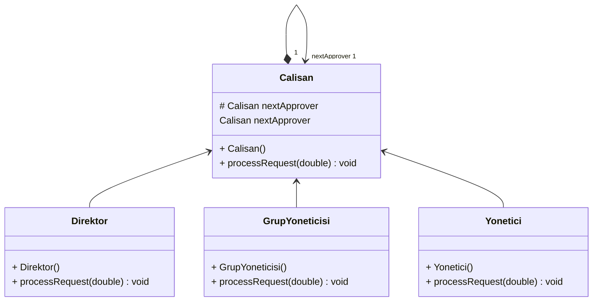

# Chain of Responsibility Tasarım Deseni Anlama
## Sorumluluk Zinciri Tasarım Deseni

Sorumluluk Zinciri Tasarım Deseni olarak bilinen bu davranışsal desen, bir isteği çeşitli işleyicilerden geçirerek onu uygun şekilde işlemenizi sağlayarak iş akışınızı düzenlemenize yardımcı olan bir yöntemdir. Bu desen, özellikle web geliştiricileri için ara yazılım tasarımlarında faydalı olabilecek ilk davranışsal desenlerden biridir.

### Nasıl Çalışır?

Sorumluluk Zinciri deseni, belirli davranışları işleyici nesnelerine dönüştürmeye dayanır. Her adım bağımsız bir işleyici sınıfı haline gelir ve tek bir kontrol yöntemi içeren bu sınıfı içermektedir. İstek ve tüm veriler bu yönteme parametre olarak gönderilir.

Bu desen, işleyici sınıflarını bir zincire bağlamayı önerir. Zincirdeki her işleyici, bir sonraki işleyiciye bir referans tutar. İstek zincirdeki her işleyiciden geçer. İşleyiciler, isteği durdurma seçeneğine sahipken ve süreci duraklatabilir böylelikle bir isteğin erken durdurulması gerektiğinde ardışık adımlar yürütülmeyecektir.

### Kullanım Durumları

Sorumluluk Zinciri tasarım deseni kullanılırken aşağıdaki durumları göz önünde bulundurmalısınız:
- Programınızın farklı türde istekleri çeşitli şekillerde işlemesi gerekiyorsa ancak türlerini veya sıralarını önceden bilmiyorsanız.
- Birkaç işleyiciyi alt alta sıralı olarak yürütmeniz gerekiyorsa.
- Belirli bir işleyici dizisinin öğeleri ve sırasının çalışma zamanında dinamik olarak değişmesi gerekiyorsa.

### Faydaları

Sorumluluk Zinciri deseni, istekleri dinamik olarak ele almak için esnek bir çözüm sunar. Uygun şekilde uygulandığında, kod tabanınızı basitleştirerek bakım ve ölçeklenebilirlik açısından avantaj sağlayabilir ve yazılım geliştirme sürecini daha verimli ve kaliteli hale getirebilir. Bu desen, özellikle kontrol süreçlerinin sıralı olarak gerçekleştirilmesi gereken durumlarda büyük fayda sağlayabilir.

---

## Chain of Responsibility Design Pattern

The Chain of Responsibility Design Pattern, also known as the Responsibility Chain Design Pattern, is a behavioral design pattern that helps you organize your workflow by passing a request through various handlers to handle it appropriately. This pattern is one of the first behavioral patterns that can be useful, especially in middleware designs for web developers.

### How Does it Work?

The Chain of Responsibility pattern relies on converting specific behaviors into handler objects. Each step becomes an independent handler class containing a single control method. The request and all data are sent to this method as parameters.

This pattern suggests linking handler classes in a chain. Each handler in the chain holds a reference to the next handler. The request passes through each handler in the chain. While handlers have the option to stop the request and can pause the process, no consecutive steps will be executed when a request needs to be stopped early.

### Use Cases

When using the Chain of Responsibility design pattern, consider the following situations:
- If your program needs to handle different types of requests in various ways, but you don't know their types or sequences in advance.
- If you need to execute several handlers sequentially.
- If the elements and sequence of a specific handler array need to change dynamically at runtime.

### Benefits

The Chain of Responsibility pattern provides a flexible solution for dynamically handling requests. When implemented properly, it can simplify your codebase, providing advantages in terms of maintenance and scalability, making the software development process more efficient and of higher quality. This pattern can be particularly beneficial when sequential execution of control processes is required.

---
# Avans Ödeme Sistemi UML Class Diyagramı


---

# Authendication Örneği UML Diyagramı
```mermaid
classDiagram
direction BT
class AuthenticationHandler {
  + AuthenticationHandler(Handler) 
  + handleRequest(Request) void
}
class CachingHandler {
  + CachingHandler(Handler) 
  + handleRequest(Request) void
}
class DataCleaningHandler {
  + DataCleaningHandler(Handler) 
  + handleRequest(Request) void
}
class Handler {
<<Interface>>
  + handleRequest(Request) void
}
class Request {
  + Request(String) 
   String data
}

AuthenticationHandler  ..>  Handler 
AuthenticationHandler "1" *--> "nextHandler 1" Handler 
CachingHandler  ..>  Handler 
CachingHandler "1" *--> "nextHandler 1" Handler 
DataCleaningHandler  ..>  Handler 
DataCleaningHandler "1" *--> "nextHandler 1" Handler 
