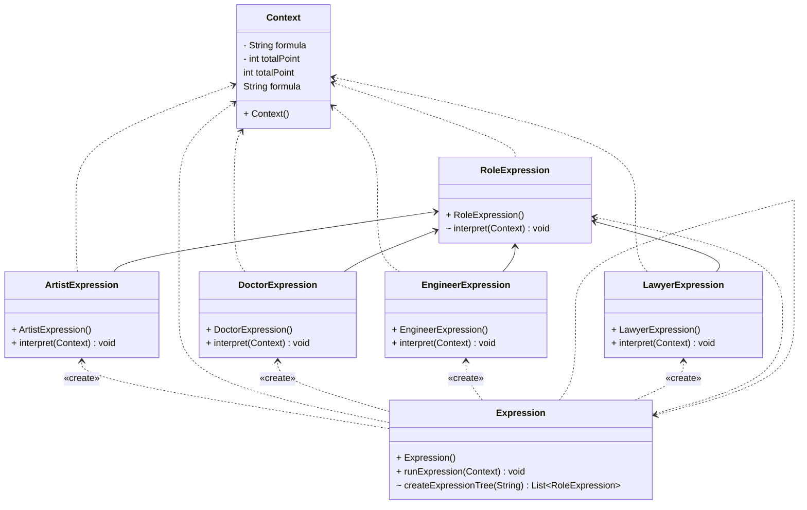

# Interpreter Tasarım Deseni : 

İşlevselliğine ait, belirli kurallara bağlı olan yazılı metinlerin sayısal veya mantıksal olarak işlenmesi gereken durumlarda ve kural işletme motorları için sıkça kullanılan bir tasarım deseni olan Interpreter, behavior grubuna aittir. Bu desen, metinleri yorumlayarak belirli bir işlemi gerçekleştirmek üzere kullanılır ve genellikle dil işleme, veri tabanı sorguları veya simgesel matematiksel işlemler gibi alanlarda tercih edilir.

Interpreter tasarım deseninin temel amacı, belirli bir dilin semantiğini yorumlamak ve bu dildeki ifadeleri işlemektir. Bu desen genellikle bir dil işleyici oluşturmak için kullanılır, bu sayede belirli bir dildeki ifadelerin yorumlanması ve işlenmesi mümkün hale gelir.

örnek olarak, roma rakamlarının sayısal karşılığını bulan bir program için; Roma rakamları, farklı sembolik ifadelerin bir araya gelmesiyle oluşur ve bu ifadelerin yorumlanması interpreter deseni ile gerçekleştirilebilir.

TerminalExpression ve NonterminalExpression isimli iki farklı Expression tipi olduğunu düşünürsek. Basit bir örnekle, her bir roma rakamı sembolü TerminalExpression olarak kabul edilebilirken, toplama, çıkarma gibi ifadeler NonterminalExpression olarak düşünülebilirdi.

Bu desen, karmaşık dil yapılarını yorumlamak ve işlemek için uygun bir seçenektir. Özellikle dil işleme, veri tabanı sorguları veya matematiksel ifadeler kadar farklı alanlarda da kullanılabilir. Belirli bir dildeki semantik yapıların yorumlanması ve işlenmesi, bu desen sayesinde kolaylıkla gerçekleştirilebilir.

Kısacası, interpreter tasarım deseni, belirli bir dilin semantiğini yorumlamak ve bu dildeki ifadeleri işlemek için etkili bir tasarım desenidir. Karmaşık dil yapılarının yorumlanması ve işlenmesi gereken durumlarda, bu desenin kullanımı yazılımın esnekliğini artırabilir ve karmaşık yapıları daha kolay yönetilebilir hale getirebilir. Bundan dolayı, interpreter tasarım deseninin yazılım geliştirme süreçlerinde önemli bir yerinin olduğunu vurgulayabiliriz.

---

Interpreter design pattern belongs to the behavioral group and is commonly used for cases where textual data, subject to specific rules, needs to be processed numerically or logically for rule execution engines. This pattern is utilized to interpret texts to perform a specific operation and is often preferred in areas such as language processing, database queries, or symbolic mathematical operations.

The fundamental purpose of the Interpreter design pattern is to interpret the semantics of a specific language and process expressions in that language. It is commonly used to create a language interpreter, enabling the interpretation and processing of expressions in a specific language.

For example, for a program that finds the numerical equivalent of Roman numerals, Roman numerals are formed by the combination of different symbolic expressions, and the interpretation of these expressions can be achieved through the interpreter pattern.

Considering two different types of expressions named TerminalExpression and NonterminalExpression, in a simple example, each symbol of a Roman numeral could be considered as TerminalExpression, while operations like addition and subtraction could be considered as NonterminalExpression.

This pattern is a suitable option for interpreting and processing complex language structures, and can be used in various fields beyond language processing, such as database queries or mathematical expressions. Interpreting and processing the semantic structures of a specific language can be easily accomplished through this pattern.

In summary, the interpreter design pattern is an effective design pattern for interpreting the semantics of a specific language and processing expressions in that language. In cases where complex language structures need to be interpreted and processed, the use of this pattern can increase the flexibility of software and make complex structures more manageable. Therefore, it can be emphasized that the interpreter design pattern has an important place in software development processes.

---

# Job Expression Örneği UML Class Diyagramı

# Roma Rakamı Örneği UML Class Diyagramı

