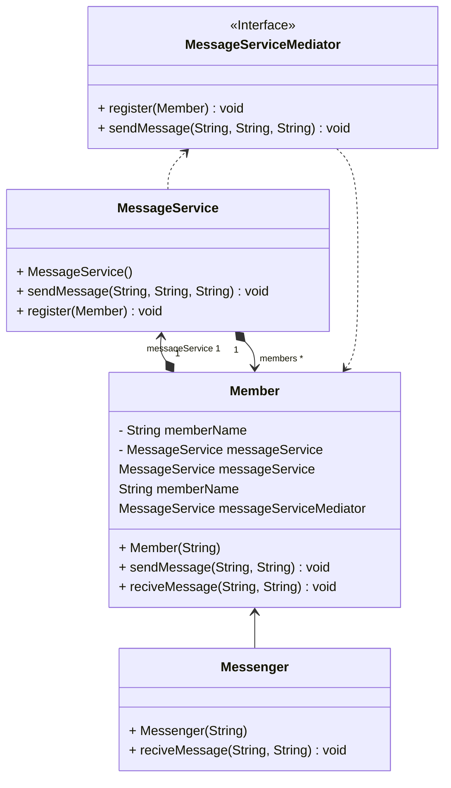
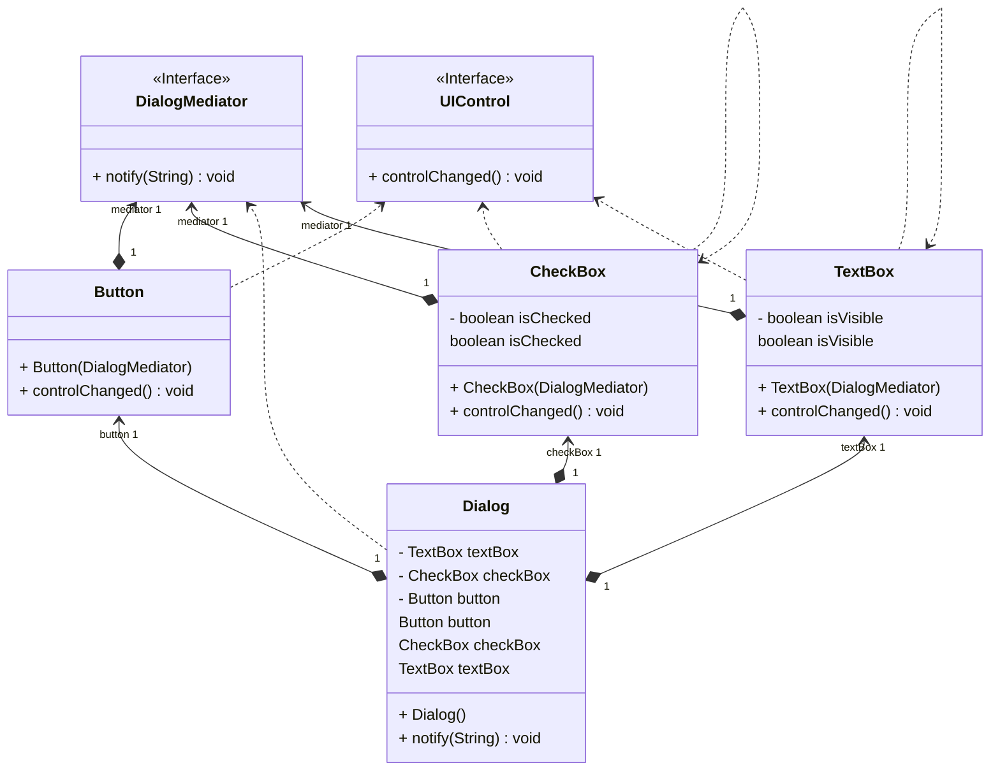

## Mediator Design Pattern

Yazılım geliştirme süreçlerinde, objeler arasındaki karmaşık bağımlılıkları organize etmek ve yönetmek zorlayıcı bir görev olabilir. Bu zorluğun üstesinden gelmek için **Mediator (Ortak)** tasarım deseni geliştirilmiştir. Bu desen, objeler arasındaki etkileşimi düzenleyerek sistemleri daha modüler ve bakımı daha kolay hale getirir. Mediator deseni, doğrudan iletişimi kısıtlayarak karmaşıklığı azaltır ve objeler arasındaki iletişimi tek bir aracı üzerinden sağlar.

Örnek bir senaryo düşünelim: Müşteri profillerini oluşturmak ve düzenlemek için bir diyalog arayüzü geliştiriyorsunuz. Arayüzde metin alanları, işaret kutuları, düğmeler gibi birçok bileşen bulunmaktadır. Geliştirme sürecinin ilerlemesiyle birlikte, bu bileşenler arasındaki ilişkiler karmaşık hale gelebilir. Örneğin, bir işaret kutusunu seçtiğinizde başka bir alanın görünür hale gelmesi gerekebilir veya veri göndermeden önce belirli kontroller yapılması gerekebilir.

Bu tür etkileşimlerin doğrudan kod içine entegre edilmesi, kod karmaşıklığını artırabilir ve yeniden kullanılabilirliği azaltabilir. İşte burada Mediator deseninin önemi ortaya çıkar. Mediator, objeler arasındaki doğrudan iletişimi keser ve tek bir aracı üzerinden iletişimi sağlar. Bu sayede objeler, birbirlerine doğrudan bağımlı olmak yerine Mediator aracılığıyla iş birliği yaparlar. Bu da sistemi daha modüler hale getirir ve bakım işlemlerini kolaylaştırır.

Mediator deseninin kullanıldığı durumlarda, sıkı bağlı olan sınıfların esneklik kazandığı, yeniden kullanılabilirliğin arttığı ve karmaşıklığın azaldığı gözlemlenir. Ayrıca, değişikliklerin daha kolay uygulanabilmesi ve bakımın daha az zaman alması gibi avantajlar da sağlanır.

Örnek olarak, bir form elemanının davranışını değiştirmek istediğinizde, bu değişikliği doğrudan form elemanının koduna eklemek yerine Mediator üzerinden gerçekleştirebilirsiniz. Böylelikle, diğer form elemanlarına olan etkileşimi minimize eder ve kodun daha düzenli olmasını sağlarsınız.

Mediator deseni, Chain of Responsibility, Command, Observer gibi diğer tasarım desenleriyle ilişkilidir ve birlikte kullanılabilir. Örneğin, isteğin dinamik olarak birden fazla alıcıya ulaştırılmasını sağlayan Chain of Responsibility deseniyle birlikte kullanılabilir. Benzer şekilde, Observer deseniyle birlikte kullanılarak dinamik abonelik mekanizmaları oluşturulabilir.

Sonuç olarak, Mediator tasarım deseni, yazılım geliştirme süreçlerinde objeler arasındaki karmaşıklığı azaltmak ve sistemleri daha modüler hale getirmek için güçlü bir çözüm sunar. Doğru şekilde uygulandığında, daha temiz, düzenli ve bakımı kolay bir kod yapısı sağlar. Bu da geliştirme süreçlerini daha verimli hale getirir ve yazılımın kalitesini artırır.

---

In software development processes, organizing and managing complex dependencies between objects poses a significant challenge. To overcome this difficulty, the Mediator design pattern has been developed. This pattern regulates interactions between objects, making the system more modular and easier to maintain. The Mediator pattern reduces complexity by restricting direct communication and instead facilitates communication between objects through a single intermediary.

To illustrate with an example, let's say you're developing a dialog interface to create and edit customer profiles. The interface contains various elements such as text fields, checkboxes, buttons, and so on. As the development process progresses, the relationships between interface elements can become complex. For instance, selecting a checkbox might require another field to become visible, or certain checks to be performed before sending data.

Integrating such interactions directly into the code increases code complexity and reduces reusability. This is where the importance of the Mediator pattern becomes apparent. The Mediator cuts off direct communication between objects and ensures communication through a single intermediary. This allows objects to collaborate through the Mediator rather than being directly dependent on each other, making the system more modular and simplifying maintenance tasks.

In situations where the Mediator pattern is observed, there is a common occurrence of tighter coupled classes gaining flexibility, increased reusability, and reduced complexity. Additionally, the ease of implementing changes and spending less time on maintenance are notable advantages.

For example, when you want to change the behavior of a form element, you can achieve this through the Mediator instead of directly modifying the code of the form element. This minimizes interaction with other form elements and ensures cleaner code.

The Mediator pattern is associated with other design patterns such as Chain of Responsibility, Command, and Observer, and can be used together in a complementary manner. For instance, it can be combined with the Chain of Responsibility pattern to dynamically deliver requests to multiple recipients. Similarly, when used with the Observer pattern, dynamic subscription mechanisms can be created.

In conclusion, the Mediator design pattern offers a robust solution to reduce complexity between objects and make the system more modular in software development processes. When applied correctly, it contributes to the creation of a cleaner, more organized, and easier-to-maintain code structure. This, in turn, enhances the efficiency of development processes and improves the quality of the software.

---

# Messenger Örneği UML Class Diyagramı

# UI Form Örneği UML Class Diyagramı

