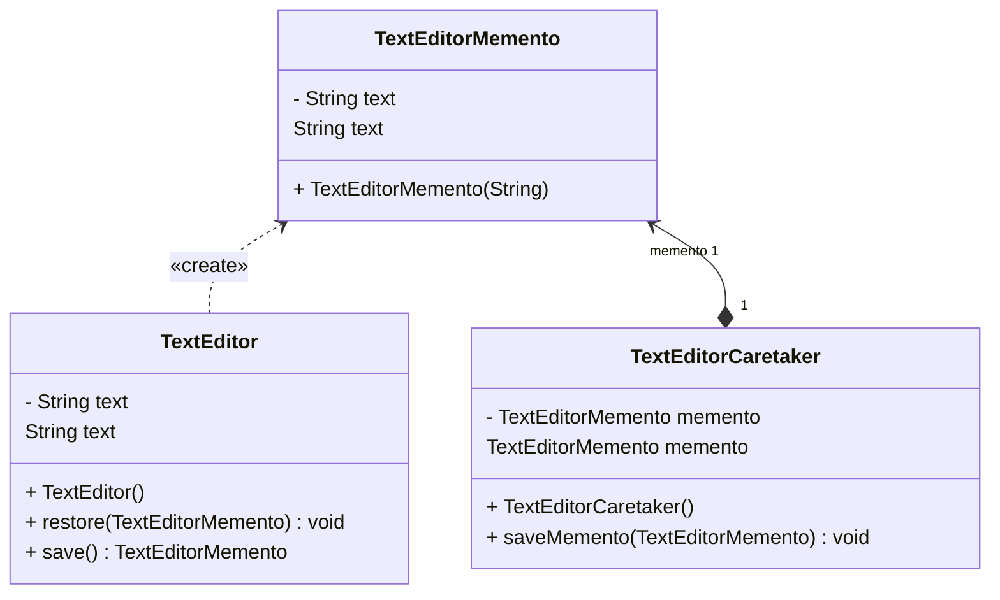

## Memento Tasarım Deseni: Yazılım Geliştirme Dünyasında Esneklik ve Adaptasyon

Yazılım geliştirme sürecinde, nesneler arasındaki ilişkilerin dinamik olarak yönetilmesi ve sistemlerin modüler olması büyük önem taşır. Bu ihtiyaçları karşılamak için kullanılan güçlü araçlardan biri de **Memento** tasarım desenidir. Memento deseni, bir nesnenin önceki durumunu kaydetmesine ve geri getirmesine olanak tanır, böylece esneklik ve adaptasyon yeteneği korunur.

Örneğin, bir metin düzenleyici uygulaması geliştirdiğimizi varsayalım. Kullanıcıların yaptığı değişiklikleri geri alabilmelerini sağlayan bir özellik eklemek istiyoruz. Memento deseni, bu özelliği her işlemden önce her nesnenin mevcut durumunu bir depolama alanına kaydederek uygulamak için idealdir. Bu sayede kullanıcılar, geri alma işlevini kullanarak değişiklikleri geri alabilirler.

Memento deseninin uygulanabilirliği geniş bir yelpazeye sahiptir. Örneğin, bir nesnenin önceki durumuna geri getirilmesi gerektiğinde anlık görüntüler oluşturmak için kullanılabilir. Ayrıca, bir nesnenin alanlarına erişmek kapsam sınırlarını ihlal ediyorsa, Memento deseni bu durumu düzeltebilir.

Bu desen ayrıca diğer tasarım desenleriyle de ilişkilidir. Örneğin, **Strategy Tasarım Deseni** ile bir araya getirilerek geri alma işlevi uygulanabilir. **Iterator Tasarım Deseni** ile birlikte kullanılarak mevcut gezinim durumu yakalanabilir ve gerektiğinde geri alınabilir.

Memento tasarım deseni, nesne durumlarını esnek ve kapsüllenmiş bir şekilde yönetmek için sağlam bir çözüm sunar. Bu desen, yazılım sistemlerinin bakımını kolaylaştırır ve geliştiricilere değerli bir araç sunar. Nesneler arasındaki ilişkilerin dinamik olarak yönetilmesi ve sistemlerin modüler olması gerektiği durumlarda Memento tasarım deseni, esneklik ve adaptasyon yeteneği sağlayarak yazılım geliştirme sürecine katkıda bulunur.

Sonuç olarak, Memento tasarım deseni, yazılım geliştirme dünyasında önemli bir yere sahiptir ve sistemlerin esnekliğini ve adaptasyon yeteneğini koruyarak güçlü bir araç olarak kabul edilmektedir.

---

The Memento design pattern is a powerful tool used in the software development world for dynamically managing relationships between objects and making systems modular. This pattern allows an object to save and restore its previous state, thus preserving flexibility and adaptability.

Let's say we're developing a text editor application and we want to add a feature that allows users to undo their changes. The Memento pattern is ideal for implementing this feature by saving the current state of each object to a storage area before each operation. This way, users can undo changes using the undo function.

The applicability of the Memento pattern is broad. It can be used to create snapshots when a previous state of an object needs to be restored. Additionally, if accessing the fields of an object violates encapsulation, the Memento pattern can address this issue.

The Memento pattern is also related to other design patterns. For example, it can be combined with the Strategy Design Pattern to implement undo functionality. It can also be used in conjunction with the Iterator Design Pattern to capture the current navigation state and undo it when necessary.

In conclusion, the Memento design pattern provides a robust solution for managing object states in a flexible and encapsulated manner. This pattern simplifies maintenance of software systems and provides developers with a valuable tool.

---

# TextEditör Örneği UML Class Diyagramı

