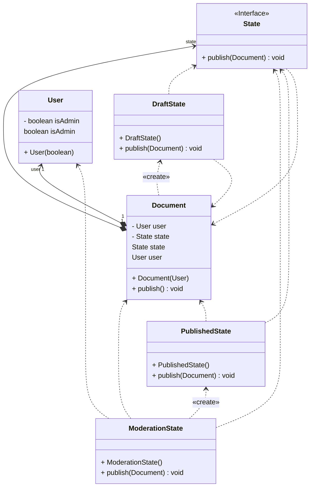

## State Tasarım Deseni: Nesnelerin Davranışlarını Değiştirmek için Bir Yol

Yazılım geliştirme sürecinde, nesnelerin farklı durumlarında farklı davranışlar sergilemesi gereken durumlarla sık sık karşılaşılır. Bu durumlar ve davranışlar zamanla değişebilir ve bu durumlar arasında geçişlerde tekrarlayan kodlar oluşturabilir. İşte bu noktada **State** tasarım deseni devreye girer.

State tasarım deseni, bir nesnenin iç durumu değiştiğinde davranışını da değiştirmesini sağlayan bir tasarım desenidir. Bu desen, nesne sınıfını değiştirmiş gibi davranarak, farklı durumlarda farklı davranışların uygulanmasını sağlar. Örneğin, bir belge nesnesinin taslak, moderasyonda ve yayımlanmış durumlarında farklı davranışlar sergilemesi gerekiyorsa, State deseni bu durumları ayrı sınıflara yerleştirerek kodun yönetilebilirliğini artırır.

State deseni genellikle **sonlu durum makineleri** kavramıyla ilişkilendirilir. Sonlu durum makinesi, bir programın sınırlı sayıda durumda olabileceği ve her durumda programın farklı davranışlar sergileyebileceği bir yapıyı ifade eder. Programın mevcut durumuna bağlı olarak, durumları birbirine geçiş yapabilir veya geçiş yapılamayabilir. Bu geçişler önceden belirlidir ve sınırlı sayıdadır.

State deseni, nesnelerin tüm olası durumları için ayrı bir sınıf oluşturmanızı ve her duruma özel davranışları bu sınıf içine yerleştirmenizi önerir. Bu durum nesneleri, **bağlam** adı verilen orijinal nesnenin davranışlarını gerektiğinde değiştirir. Bu sayede, sınıfınızda belirli alanların değerlerine göre davranışını değiştirmeniz gerektiğinde ve bu durumlar arasında geçişlerde tekrarlayan kodlar varsa, State deseni kullanılabilir.

State tasarım deseni, nesnelerin davranışlarını değiştirmek ve kodun yönetilebilirliğini artırmak için güçlü bir araçtır. Farklı durumların ve davranışların modüler bir şekilde yönetilmesini sağlayarak, yazılım geliştirme sürecini kolaylaştırabilir. Ayrıca, karmaşık durum makinesi yapılarını daha anlaşılır hale getirerek, kodun bakımını ve genişletilmesini kolaylaştırabilir.

State deseni, **Bridge**, **Strategy** ve **Adapter** gibi diğer desenlerle benzer yapıya sahiptir. Her biri işi başka nesnelere delege ederek çalışır. Ancak, her biri farklı bir soruna çözüm sunar. State deseni, durumlar arasında geçişler yapılmasını sağlar ve birbirleriyle etkileşim halinde olabilirken, Strategy deseni tamamen bağımsızdır.

Sonuç olarak, State tasarım deseni, yazılım geliştirme sürecinde nesnelerin davranışlarını değiştirmek ve kodun yönetilebilirliğini artırmak için önemli bir araçtır. Karmaşık durumları modüler bir şekilde yönetmek ve kodun bakımını kolaylaştırmak için State desenini kullanmak, yazılım projelerinin başarısında önemli bir rol oynayabilir. Bu nedenle, State deseninin prensiplerini anlamak ve uygulamak yazılım geliştirme sürecinde büyük fayda sağlayabilir.

---

## State Design Pattern: A Way to Change Object Behaviors

In software development processes, it's common to encounter situations where objects need to exhibit different behaviors based on their current state. These states and behaviors may change over time, leading to repetitive code when transitioning between states. This is where the **State** design pattern comes into play.

The State design pattern allows an object's behavior to change when its internal state changes. By behaving as if the object's class has changed, it enables different behaviors to be applied in different states. For example, if a document object needs to exhibit different behaviors in draft, under moderation, and published states, the State pattern enhances code manageability by organizing these states into separate classes.

The State pattern is often associated with the concept of **finite state machines**. A finite state machine represents a structure where a program can exist in a limited number of states, and each state allows the program to exhibit different behaviors. Depending on the current state of the program, transitions between states can or cannot occur. These transitions are predetermined and limited in number.

To implement the State pattern, it's recommended to create a separate class for each possible state of an object and place the specific behaviors for each state within these classes. These state classes, when necessary, alter the behavior of the object referred to as the **context**. This approach enables changing behavior based on specific field values in your class and helps eliminate repetitive code during state transitions.

The State design pattern serves as a powerful tool to change object behaviors and enhance code manageability. By facilitating the modular management of different states and behaviors, it can simplify the software development process. Additionally, by making complex state machine structures more understandable, it aids in code maintenance and extensibility.

The State pattern shares similarities with other design patterns such as **Bridge**, **Strategy**, and **Adapter**. Each of these patterns delegates tasks to other objects but provides solutions to different problems. While the State pattern allows transitions between states and interaction among them, the Strategy pattern remains entirely independent.

In conclusion, the State design pattern is an important tool in software development for changing object behaviors and improving code manageability. Utilizing the State pattern to manage complex states in a modular way and simplify code maintenance can play a significant role in the success of software projects. Therefore, understanding and implementing the principles of the State pattern can provide substantial benefits in the software development process.

---

# Döküman Yayımlama Örneği UML Class Diyagramı

