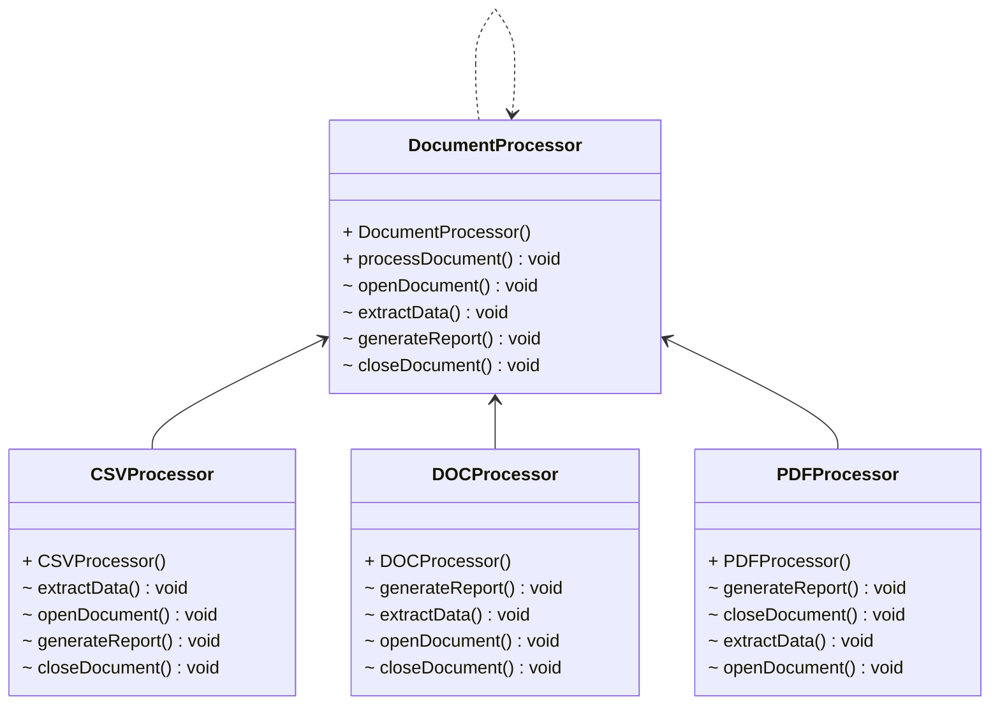

## Template Tasarım Deseni

Veri madenciliği uygulamaları geliştiren biri olarak, belgeleri farklı biçimlerde (PDF, DOC, CSV) beslemek ve bu belgelerden anlamlı veriler çıkarmak üzerine çalıştığımızı düşünelim. Başlangıçta sadece DOC dosyalarıyla çalıştığımızı farz edelim. Ancak daha sonra bir karar vererek "CSV dosyalarını da destekleyelim!" dediğimizi ve bir ay sonra da "Neden PDF dosyalarından veri çıkarmıyoruz ki?" diye düşündüğümüzü varsayalım.

İşte tam bu noktada Şablon Yöntemi devreye girer! Bu tasarım deseni, algoritmanın iskeletini oluşturarak, alt sınıfların belirli adımlarını değiştirmesine olanak tanır. Yani aynı temel algoritmayı kullanarak farklı adımları değiştirebilirsiniz. Tek bir şablon yöntemi içerisinde tüm adımları bir araya getirerek, kod tekrarından kurtulmanızı sağlar.

Temel olarak, belge işleme adımlarını içeren bir temel sınıf oluştururuz. Bu sınıf, çeşitli belge işleme adımlarına yönelik bir dizi çağrıdan oluşan bir şablon yöntemi tanımlar. Sonra da alt sınıfları bu temel şablonu kullanmaya zorlarız. Böylece her alt sınıf, kendi uygulamalarını belirlerken, temel algoritmayı korumuş oluruz.

Ayrıca, ham verileri analiz etmek ve raporları oluşturmak gibi ortak adımları temel sınıfa çekerek, tekrarlanan kodlardan kurtulabiliriz. Bu sayede, farklı veri formatları için değişen kodlar alt sınıflarda kalırken, ortak adımları tek bir yerde tutabiliriz.

Şablon Yöntemi deseni sayesinde, algoritmayı genişletmek istediğimizde tüm yapıyı değiştirmek zorunda kalmayız. İstemcilerin yalnızca belirli adımları genişletmesine izin verir ve üst sınıfın yapısının değişmemesini garanti altına alır.

Eğer benzer uygulamalara sahip adımları bir üst sınıfa çekmek ve kod tekrarını ortadan kaldırmak istiyorsanız, Şablon Yöntemi tasarım desenini mutlaka düşünmelisiniz.

Sonuç olarak, Şablon Yöntemi deseni sayesinde algoritmalarınızı esnek bir şekilde genişletebilir ve kod tekrarından kurtulabilirsiniz. Bu da sizi hem zamandan hem de baş ağrısından kurtarır.

Bu tasarım deseni, veri madenciliği uygulamalarında büyük önem taşımaktadır ve uygulamalarımızın daha esnek ve yönetilebilir olmasını sağlar. Şablon Yöntemi deseni ile algoritmalarımızın genişlemesini kolaylaştırabilir ve verimliliği artırabiliriz. Umarım bu yazı, Şablon Yöntemi deseninin ne olduğunu anlamanıza yardımcı olmuştur.

---

## Template Design Pattern

As someone developing data mining applications, imagine working on feeding documents in different formats (PDF, DOC, CSV) and extracting meaningful data from these documents. Let's say initially we only work with DOC files. However, later on, we decide to "Let's support CSV files too!" and a month later, we think "Why not extract data from PDF files as well?"

This is where the Template Method comes into play! This design pattern creates the skeleton of an algorithm, allowing subclasses to alter specific steps. In other words, you can change different steps while using the same basic algorithm. By encapsulating all steps within a single template method, it helps eliminate code repetition.

Essentially, we create a base class that contains document processing steps. This class defines a template method consisting of a series of calls to various document processing steps. Then, we force subclasses to use this base template. This way, while each subclass determines its own implementations, we maintain the basic algorithm.

Moreover, by pulling common steps like analyzing raw data and generating reports into the base class, we can eliminate repeated code. Thus, while the subclass retains the code specific to different data formats, we keep common steps in one place.

With the Template Method pattern, when we want to extend the algorithm, we don't have to change the entire structure. It only allows clients to extend specific steps while ensuring the structure of the superclass remains unchanged.

If you want to pull shared steps of similar applications into a superclass and eliminate code repetition, you should definitely consider the Template Method design pattern.

In conclusion, with the Template Method pattern, you can flexibly extend your algorithms and eliminate code repetition, saving you both time and headaches.

This design pattern is crucial in data mining applications, making our applications more flexible and manageable. With the Template Method pattern, we can facilitate the expansion of our algorithms and increase efficiency. Hopefully, this article has helped you understand what the Template Method pattern is all about.

---

# Document Processor Örneği UML Class Diyagramı

