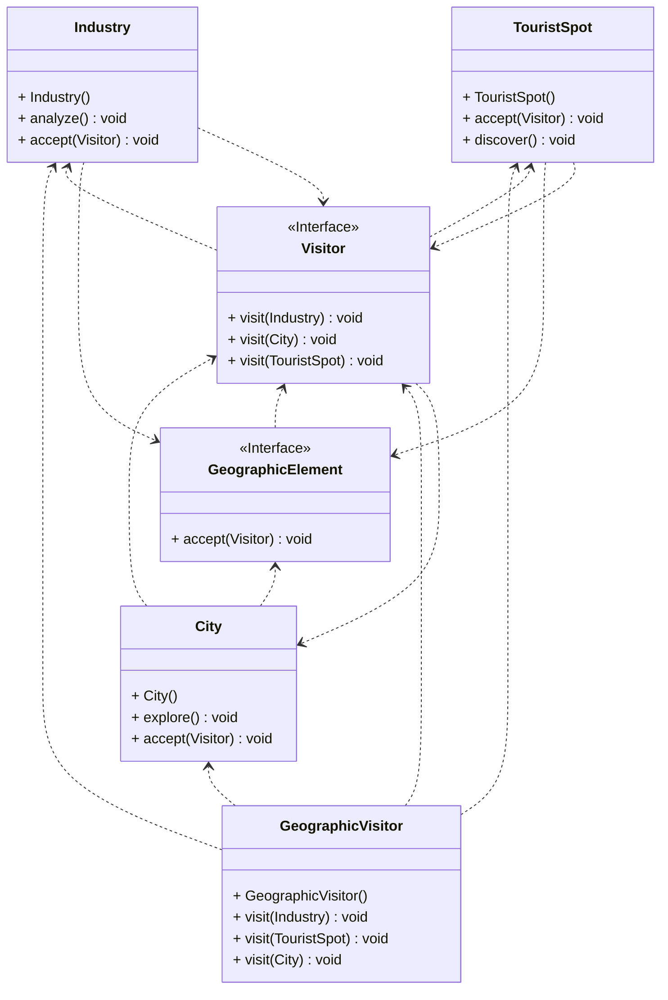

## Visitor Tasarım Deseni

Bu desen, algoritmaları üzerinde çalıştıkları nesnelerden ayırmanıza olanak sağlayan bir davranışsal tasarım kalıbıdır.

Hayal edin ki, ekibiniz devasa bir coğrafi bilgi grafiği üzerinde çalışıyor. Her bir düğümü bir şehir gibi kompleks bir varlığı temsil ediyor olabileceği gibi, sanayi, gezi alanları gibi daha ayrıntı olan şeyleri de temsil edebilsin. İşte tam da bu noktada ziyaretçi deseni devreye giriyor.

Başlangıçta, bu grafik yapısını XML formatında dışarıya aktarmak oldukça basit görünüyordu. Ancak sistem mimarı mevcut düğüm sınıflarını değiştirmenize izin vermedi. Kodun zaten canlıda olduğunu ve değişikliklerinizdeki olası bir hata nedeniyle kodu bozma riskini almak istemediğini söyledi. Bu durumda ziyaretçi deseni devreye giriyor ve yeni davranışı mevcut sınıflara entegre etmek yerine, ayrı bir sınıfa koymanızı öneriyor.

Ama tabii ki her şey bu kadar basit değil. XML'e aktarma metodunun tüm düğüm sınıflarına eklenmesi, bu değişiklikle birlikte oluşabilecek bir bug'ın uygulamayı bozma riski nedeniyle kabul edilmedi. Ayrıca pazarlama departmanından birinin farklı bir formata dışa aktarma özelliği veya başka garip şeyler istemesi de muhtemeldi. İşte tam da bu noktada ziyaretçi deseni devreye girerek, her düğüm sınıfı için farklı davranışları kolayca entegre etmenizi sağlıyor.

Ancak bu metodları çağırmak da kolay değil tabii. Her metodun farklı bir kullanım şekli olduğunu dikkate alınca polimorfizm kullanamayız. Verilen nesneyi doğru şekilde işleyebilecek bir metod belirlemek için, nesnenin sınıfını kontrol etmemiz gerekiyor. Bu size de işkence gibi gelmedi mi? İşte tam da bu noktada ziyaretçi deseni devreye girerek, doğru metodun çalıştırılmasını sağlıyor ve sizin işinizi kolaylaştırıyor.

Sonuç olarak, ziyaretçi deseni sayesinde düğüm uç sınıflarını değiştirmek zorunda kaldık ama yaptığımız değişiklik oldukça basit ve ileride kodu değiştirmeden başka değişiklikler yapmamıza olanak sağlıyor. Tüm visitor’ler için ortak bir arayüz oluşturarak, mevcut tüm düğüm uçları, vereceğimiz herhangi bir visitor nesnesi ile çalışabilirler. Bu da işimizi oldukça kolaylaştırıyor.

Sonuç olarak, ziyaretçi deseni coğrafi bilgilerinizi ziyaret etmenizi sağlayan harika bir tasarım deseni diyebiliriz. Umarım bu bilgi sizin için faydalı olmuştur ve coğrafi bilgilerinizin ziyaretine keyifli bir yolculuk olmuştur!

---

Visitor Design Pattern: Visiting Geographic Information

This pattern is a behavioral design pattern that allows you to separate algorithms from the objects they work on.

Imagine your team is working on a massive geographic information graph. Each node may represent a complex entity like a city or more detailed things like industries or tourist spots. This is where the visitor pattern comes into play.

Initially, exporting this graph structure to XML format seemed quite straightforward. However, the system architect didn't allow you to modify the existing node classes. They mentioned that the code was already live, and they didn't want to risk breaking it with potential errors from your changes. This is where the visitor pattern comes in, suggesting that you put the new behavior in a separate class instead of integrating it into existing classes.

But of course, things are not that simple. Adding the export-to-XML method to all node classes was not accepted due to the risk of breaking the application with this change. Additionally, it was likely that someone from the marketing department might request a different export format or other peculiar things. This is where the visitor pattern comes in, allowing you to easily integrate different behaviors for each node class.

However, calling these methods is not easy either. Considering that each method has a different usage pattern, we cannot use polymorphism. We need to check the class of the given object to determine which method to call. Doesn't this sound like torture to you? This is where the visitor pattern comes in, ensuring that the correct method is executed and making your job easier.

In conclusion, thanks to the visitor pattern, we had to modify the leaf node classes, but the change we made is quite simple and allows us to make other changes in the future without modifying the code. By creating a common interface for all visitors, all existing leaf nodes can work with any visitor object we provide. This makes our job much easier.

In summary, we can say that the visitor pattern is a great design pattern that allows you to visit your geographic information. I hope this information has been helpful for you, and I wish you a pleasant journey visiting your geographic information!

---

# Gezi Uygulama Örneği UML Class Diyagramı

