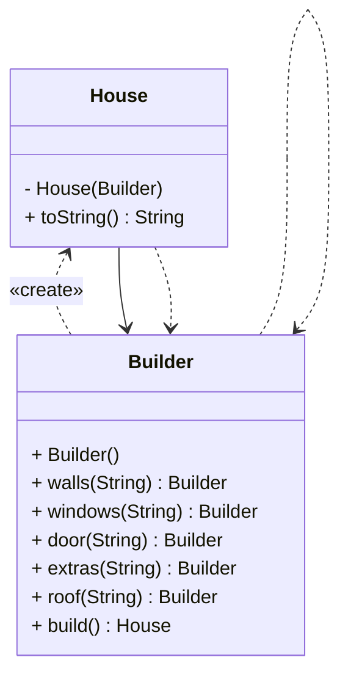
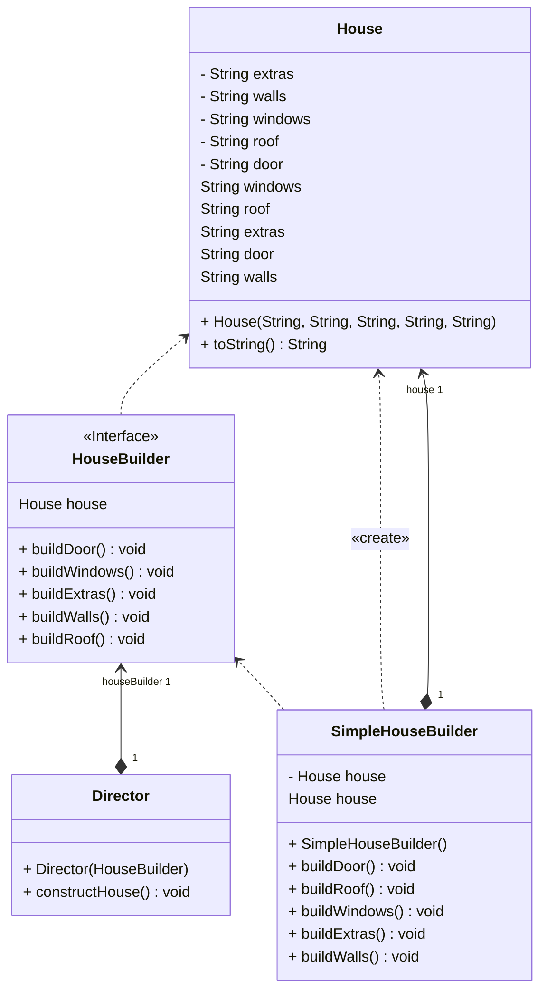

## Builder Tasarım Deseni: Karmaşıklığı Azaltmak İçin Bir Yol Haritası

Builder tasarım deseni, karmaşık nesnelerin adım adım oluşturulmasını sağlayan bir creational tasarım desenidir. Bu desen, adım adım ilerleyerek istenilen türde ve sunumda nesnelerin kolayca oluşturulmasına olanak tanır. Artık her şeyi tek bir oluşturucu koduyla halletmek zorunda değilsiniz!

Örnek olarak, evleri temsil eden House nesnesini ele alalım. Basit bir ev için dört duvar, zemin, kapı, pencere ve çatı gibi adımları izlemeniz gerekebilir. Ancak işler karmaşık hale geldiğinde, örneğin büyük veya özel gereksinimlere sahip bir ev inşa etmek istediğinizde, işler karmaşıklaşabilir. İşte burada Builder deseni devreye girer.

Builder deseni, nesne oluşturma sürecini adımlara böler ve yalnızca gereken adımları çalıştırmanıza olanak sağlar. Yüzme havuzu sadece belirli evlerde gerekiyorsa, bu özelliği sadece o ev için ekleyebilirsiniz. Diğer evler için gereksiz parametreleri düşünmek zorunda kalmazsınız.

Ayrıca, farklı türde nesneler oluşturmak için farklı yapılandırıcıları kullanabilirsiniz. Ahşap veya camdan mı yoksa taş veya demirden mi yapılan bir ev istediğinize bağlı olarak farklı yapılandırıcıları seçebilirsiniz. Her yapılandırıcı farklı bir yaklaşımla çalışır ve istemci koduyla standart bir arabirim üzerinden etkileşime geçebilir.

Ve unutulmamalıdır ki, Director sınıfı da mevcuttur! Bu sınıf, yapılandırıcı adımlarını çalıştırarak sonuç olarak işlevsel bir ürün elde etmek için gereken adımları belirler. Dolayısıyla, aslında yapılandırıcıları yönlendiren bir tür rehber olarak düşünülebilir.

Builder deseni aynı zamanda teleskopik yapılandırmadan kurtulmanıza da yardımcı olur. Artık onlarca parametre göndermek zorunda değilsiniz. Yalnızca ihtiyaç duyulan adımları çağırarak nesneleri adım adım oluşturabilirsiniz.

Tüm bunların ötesinde, Builder deseni karmaşıklığı azaltmak için harika bir rehberlik sunar. Adım adım ilerleyerek istediğiniz nesneyi oluşturabilir ve gereksiz karmaşıklıklardan kaçınabilirsiniz. Tek seferde her şeyi halletmek zorunda olmadığınızı unutmayın; adımları takip ederek istediğiniz sonuca ulaşabilirsiniz. Dolayısıyla Builder deseniyle nesne oluşturma sürecindeki karmaşıklığı aşabilirsiniz!

---

Builder Design Pattern: A Roadmap to Reduce Complexity

This creational design pattern, where complex objects are created step by step, can actually be thought of as a kind of "complex object creation guide." It allows you to easily create objects of the desired type and presentation by progressing step by step. This means you no longer have to handle everything with a single builder code!

For example, let's take houses, which are represented by the House object. For a simple house, you may need to follow steps like creating four walls, a floor, a door, windows, and a roof. However, when things get more complex, such as when you want to build a large house or a house with special requirements, it can become complicated. This is where the Builder pattern comes in.

The Builder pattern divides the object creation process into steps and allows you to run only the necessary steps. If a swimming pool is only needed for certain houses, you can add this feature only to that house. You don't have to worry about unnecessary parameters for other houses.

Additionally, you can use different builders to create different types of objects. Depending on whether you want a house made of wood and glass or one made of stone and iron, you can choose different builders. Each builder works in a different way and can interact with the client code through a standard interface.

And of course, let's not forget about the Director class! This class determines the necessary steps to obtain a functional product by executing builder steps. So, you can actually think of it as a guide that directs the builders.

The Builder pattern also helps you get rid of telescopic configuration. You no longer have to send dozens of parameters. You can create objects step by step by calling only the required steps.

Beyond all this, the Builder pattern provides a great guide to reducing complexity. By progressing step by step, you can create the object you want and avoid unnecessary complexities. Remember, you don't have to handle everything at once; by following the steps, you can achieve the desired result. So, with the Builder pattern, you can overcome the complexity in the object creation process!

---
# House Builder build

# House Builder Director UML Class Diyagramı

