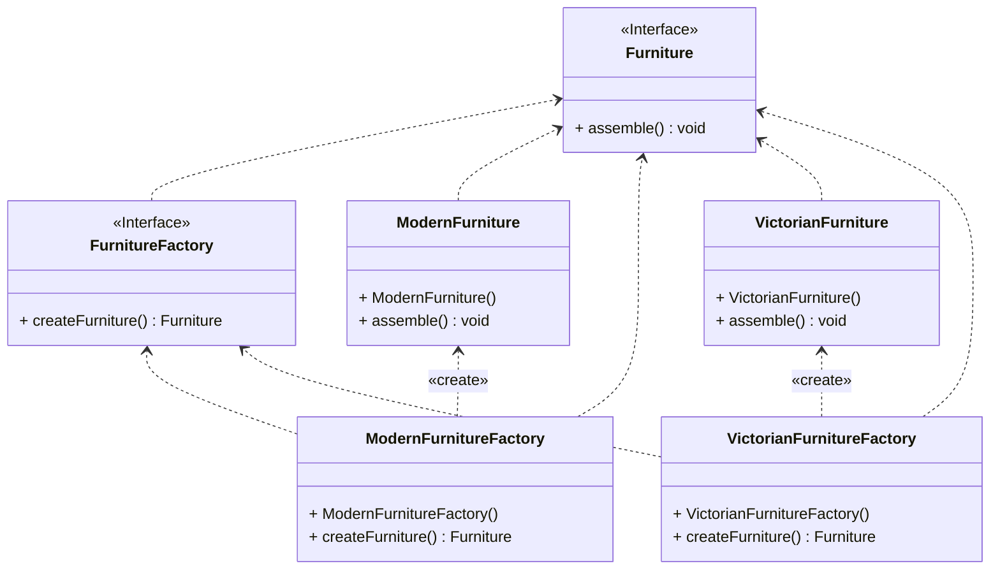

## Abstract Factory Tasarım Deseni

Abstract Factory tasarım deseni, yazılım geliştirme sürecinde oldukça kullanışlı ve esnek bir yapı sunar. Özellikle değişen ihtiyaçlara hızlı bir şekilde adapte olmak isteyen yazılım geliştiriciler için ideal bir çözüm sunar.

Bu desen, kodunuzu değiştirmeden farklı ürün ailelerine uygun hale getirmenizi sağlar. Örneğin, bir mobilya mağazası uygulaması geliştirirken, müşterilerin farklı tarzlarda koltuk, sehpa ve kanepelere ihtiyaç duyabileceğini düşünelim. Abstract Factory deseni sayesinde, bu farklı ürün tipleri için ayrı arayüzler oluşturabilir ve müşterilerin beklentilerini karşılayabilirsiniz.

Ayrıca, bu desen sayesinde kodunuzu daha modüler hale getirebilirsiniz. Her bir ürün ailesi için ayrı bir fabrika sınıfı oluşturarak, kodunuzun daha okunabilir ve bakımı daha kolay hale gelmesini sağlayabilirsiniz.

Abstract Factory deseni aynı zamanda gelecekteki değişikliklere karşı da hazırlıklı olmanızı sağlar. Örneğin, mobilya üreticileri yeni ürün modelleri çıkardığında, sadece ilgili fabrika sınıfını güncellemeniz yeterli olacaktır. Böylece, kodunuzun esnekliğini koruyabilir ve müşterilerinize her zaman en güncel ürünleri sunabilirsiniz.

Bu desen aynı zamanda kodunuzun karmaşıklığını azaltmanıza da yardımcı olur. Her bir fabrika sınıfının belirli bir görevi olması, kodunuzun daha organize ve anlaşılır olmasını sağlar.

Sonuç olarak, Abstract Factory tasarım deseni, yazılım geliştirme sürecinde kodunuzu daha esnek, modüler ve okunabilir hale getirmek istiyorsanız tercih edebileceğiniz bir desen olarak karşımıza çıkıyor. Bu desen sayesinde, müşteri beklentilerine hızlı bir şekilde yanıt verebilir ve gelecekteki değişikliklere karşı hazırlıklı olabilirsiniz.

---

The Abstract Factory design pattern can help you when you want to turn your code into a furniture store. This pattern represents an abstract factory. Be excited and creative because this factory is abstract and challenges your imagination!

Think of the design like this: Your customers want a modern style sofa but you're giving them a Victorian style coffee table. In this case, you wouldn't want to see your customers' disappointment! This is where the Abstract Factory design pattern comes into play.

This pattern suggests creating separate interfaces for each type of product. A product family consisting of stylish sofas, great couches, and amazing coffee tables! All variants include these interfaces and ensure compatibility with each other. This way, your customers are satisfied and you don't experience their disappointment.

The Abstract Factory pattern allows you to make changes easily without changing your code. If you don't want to rewrite your code entirely, you can use this pattern in the future. If furniture manufacturers change their models constantly, your site will still remain up to date!

Customers don't need to know what's inside your factory. When a customer wants a chair, they don't need to know what type of chair is being used. They simply get the chair they want and leave satisfied. If there's a Factory Class suitable for the Abstract Factory pattern, it's enough for the customer.

In conclusion, the Abstract Factory pattern can help you work with related product families in your code and if you don't want to be dependent on the content of these classes. Additionally, each class will have a specific task and reduce complexity.

The best part of this pattern is that you can think like a real factory and challenge your imagination. You can imagine the most wonderful furniture store and bring it to life with your code.

Remember, the Abstract Factory pattern not only improves your code but also makes your customers happy!

---

# Mobilya Fabrikası Örneği UML Class Diyagramı

