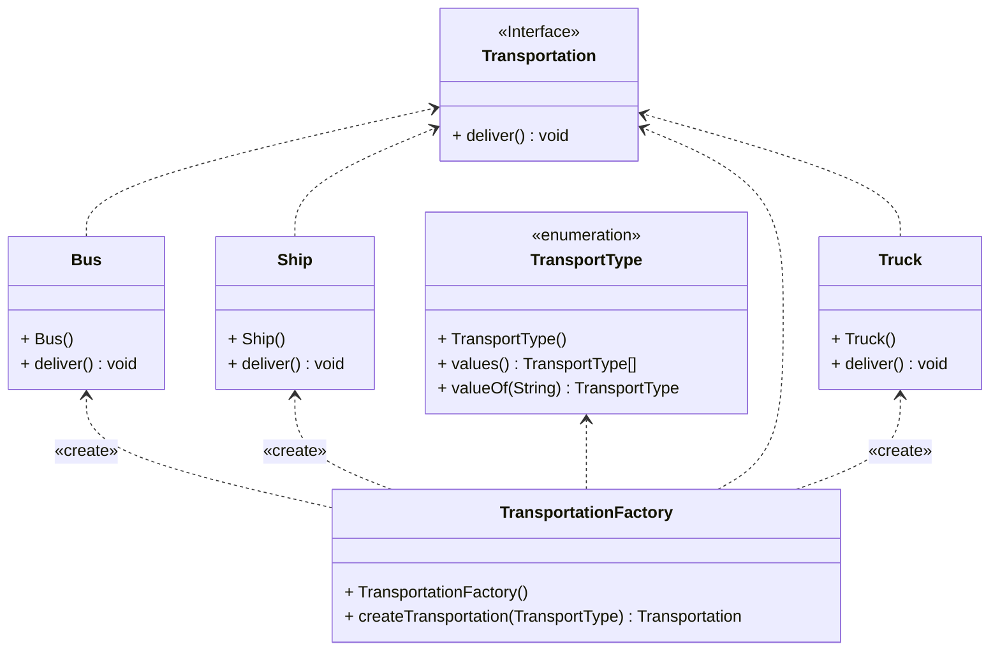

## Factory Metod Deseni

**Factory Metod deseni**, yazılım geliştirme sürecinde sıklıkla kullanılan bir tasarım desenidir. Bu desen, nesnelerin yaratılmasını ve kullanılmasını kolaylaştırarak kodun daha esnek ve bakımı kolay hale gelmesini sağlar. Özellikle farklı türde nesnelerin yaratılması ve kullanılması gereken durumlarda tercih edilen bir tasarım desenidir.

### Sorun ve Çözüm

Bir lojistik yönetim uygulaması tasarladığınızı düşünün. Başlangıçta sadece kamyon taşımacılığıyla ilgiliyken, daha sonra deniz taşımacılığını da eklemek istediğinizde karşılaşacağınız sorunları hayal edin. Kodun büyük bir kısmı kamyonlara bağımlı olduğu için deniz taşımacılığını eklemek için kodun büyük bir kısmını değiştirmeniz gerekecektir. İşte tam da bu noktada **Factory Metod deseni** devreye girer. Bu desen sayesinde nesneleri yaratma süreci sihirli bir şekilde gerçekleşir ve alt sınıfların döndürülen nesne türünü değiştirmesi mümkün olur. Yaratılan nesnelerin ortak bir arayüze sahip olması sayesinde de kodun esnekliği artar ve yeni nesneler eklemek kolaylaşır.

### Sonuç

**Factory Metod deseni**, yazılım geliştirme sürecinde kodun esnekliğini artıran ve yeni nesnelerin eklenmesini kolaylaştıran önemli bir tasarım desenidir. Bu sayede, "Şimdi bir gemi olmak istiyorum" demeniz mümkün hale gelir ve lojistik yönetim uygulamanızı istediğiniz şekilde genişletebilirsiniz. Kodunuzu değiştirmeden yeni taşıma araçları eklemek sanki bir sihirbazlık yeteneği gibi, değil mi?

**Factory Metod deseni**, yazılım geliştirme sürecinde karşılaşılan sorunları çözmek için güçlü bir araçtır ve doğru şekilde kullanıldığında kodunuzun daha okunabilir, bakımı kolay ve esnek olmasını sağlar. Bu nedenle, yazılım geliştirme sürecinde **Factory Metod deseni**ne başvurarak kodunuzu daha etkili bir şekilde yönetebilirsiniz.

---

Factory Method Pattern:

The Factory Method pattern is actually quite extraordinary. It's a creational design pattern that allows subclasses to change the type of object being created while providing an interface for creating objects in the superclass. Essentially, it's like giving subclasses the ability to say, "I want to be a ship now."

Problem: Imagine you've designed a logistics management application. Initially, it only handled truck transportation, and most of the code was truck-centric. But then, when you wanted to add sea transportation, things got complicated. Much of the code was tightly coupled to trucks, and you had to change everything to add sea transportation.

Solution: Enter the Factory Method. This method makes the object creation process magically streamlined. In other words, direct object creation calls turn into calls to a special factory method. This allows subclasses to change the type of object being returned. Essentially, they can say, "I want to be a ship now."

But of course, this magical power has a limit. The created objects need to have a common interface. So, even though trucks and ships may be different, they need to share the same method for carrying out transportation operations. Essentially, everyone needs to speak the same language.

Conclusion: The Factory Method is actually quite magical. It enables adding new objects without changing the code. It's like saying, "I want to be a ship now." This allows everyone to transport goods as they please. It's a bit like going to Hogwarts, isn't it?

---

# Transportation Örneği UML Class Diyagramı

