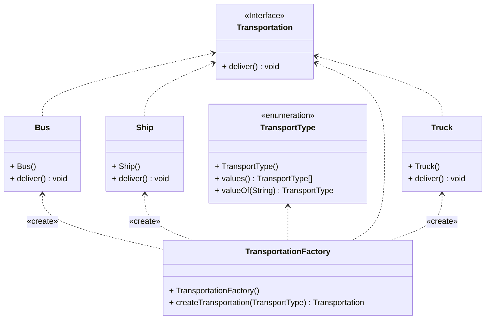

***Fabrika Metodu Deseni:***

Fabrika Metodu deseni aslında oldukça olağanüstü bir kavram. Yani, üst sınıfta nesnelerin oluşturulmasını sağlarken alt sınıfların bu oluşturulacak nesne türünü değiştirmesine izin veren bir yaratımsal desen türüdür. Yani aslında, alt sınıfların "Şimdi bir gemi olmak istiyorum" demesi gibi bir imkan sunar.

**Sorun:**
Hayal et, bir lojistik yönetim uygulaması tasarladın. Başlangıçta yalnızca kamyon taşımacılığı vardı ve kodun büyük bölümü kamyonlarla alakalıydı. Ancak daha sonra deniz taşımacılığını da eklemek istediğinde durum karmaşıklaştı. Kodun büyük bir kısmı kamyonlara fazlasıyla bağımlıydı ve deniz taşımacılığını eklemek için her şeyi değiştirmek zorundaydın.

**Çözüm:**
İşte burada fabrika metodunun devreye girdiği nokta. Bu yöntem sayesinde nesneleri yaratma süreci artık sihirli bir şekilde gerçekleşiyor. Yani, doğrudan nesne oluşturma çağrıları özel bir fabrika metoduna dönüşüyor. Bu sayede alt sınıflar, döndürülen nesne türünü değiştirebiliyor. Yani aslında, "Şimdi bir gemi olmak istiyorum" diyebiliyorlar.

Ancak elbette bu sihirli gücün bir sınırı var. Yaratılan nesnelerin ortak bir arayüze sahip olması gerekiyor. Yani kamyon ve gemi birbirlerine benzemese de, taşıma işlemlerini yapmak için aynı yöntemi paylaşmaları gerekiyor. Yani aslında, herkesin aynı dili konuşması gerekiyor.

**Sonuç:**
Fabrika metodu aslında oldukça sihirli bir kavram. Kodu değiştirmeden yeni nesneler eklemeyi mümkün kılar. Yani aslında, "Şimdi bir gemi olmak istiyorum" demenizi sağlar. Bu sayede herkes istediği gibi taşımacılık yapabilir. Sanki biraz Hogwarts'a gitmiş gibi, değil mi?

---

Factory Method Pattern:

The Factory Method pattern is actually quite extraordinary. It's a creational design pattern that allows subclasses to change the type of object being created while providing an interface for creating objects in the superclass. Essentially, it's like giving subclasses the ability to say, "I want to be a ship now."

Problem: Imagine you've designed a logistics management application. Initially, it only handled truck transportation, and most of the code was truck-centric. But then, when you wanted to add sea transportation, things got complicated. Much of the code was tightly coupled to trucks, and you had to change everything to add sea transportation.

Solution: Enter the Factory Method. This method makes the object creation process magically streamlined. In other words, direct object creation calls turn into calls to a special factory method. This allows subclasses to change the type of object being returned. Essentially, they can say, "I want to be a ship now."

But of course, this magical power has a limit. The created objects need to have a common interface. So, even though trucks and ships may be different, they need to share the same method for carrying out transportation operations. Essentially, everyone needs to speak the same language.

Conclusion: The Factory Method is actually quite magical. It enables adding new objects without changing the code. It's like saying, "I want to be a ship now." This allows everyone to transport goods as they please. It's a bit like going to Hogwarts, isn't it?

---

# Transportation Örneği UML Class Diyagramı

