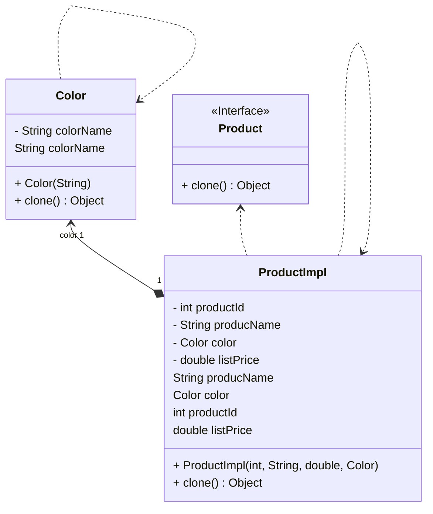

## Prototype Tasarım Deseni: Nesnelerin Kopyalanması ve Esnek Kullanımı

Prototype tasarım deseni, bir nesnenin kopyasını oluşturmak için kullanılan bir yapıdır. Bu desen, bir resmin kopyalanması gibi düşünülebilir; fakat bazen bu resmin bazı gizli detayları bulunabilir ve buna erişmek zor olabilir.

### Prototip Deseni ve Kullanım Alanları

Prototype deseni, özellikle bir nesnenin kopyasını oluşturmanın zor olduğu durumlarda idealdir. Örneğin, bir aracın rengini bilmek kolay olabilir ancak aracın boyanma süreci hakkında bilgi sahibi olmak zor olabilir. Bu desen, nesnenin kopyasını oluşturmak için klonlama işlemini klonlanan nesneye devreder ve bu işlemi yapmak için bir arayüz belirler. Böylece, nesneyi kopyalayabiliriz fakat onun sınıfına bağımlı olmayız. Bu, yeni nesneler oluştururken daha fazla esneklik sağlar.

### Kod Bağımsızlığı ve Nesne Oluşturma

Prototype deseni, kodunun diğer sınıflara bağımlı olmadığı durumlarda kullanılabilir. Örneğin, kodunuz başka bir sınıftan gelen nesnelerle çalışıyorsa ve bu nesnelerin özellikleri hakkında pek bir fikriniz yoksa, prototip deseni işe yarayabilir. Ayrıca, bu desen sınıfın alt sınıflarının sayısını azaltmak için de kullanılabilir. Yani, benzer özelliklere sahip nesneleri oluşturmak için bir sürü alt sınıf oluşturmak yerine, bir prototipi klonlayabilirsiniz.

### Sonuç

Prototype design pattern, nesnelerinizi kopyalamanıza ve daha esnek bir şekilde kullanmanıza olanak tanır. Bu desen, özellikle nesnelerinizi başka sınıflara bağımlı olmadan oluşturmanızı sağlar. Bu sayede, kodunuz daha modüler ve bakımı daha kolay hale gelir. Prototype desenini kullanarak, nesnelerinizi klonlayabilir ve esnek bir şekilde kullanabilirsiniz.

Bu desen, yazılım geliştirme sürecinde özellikle faydalı olabilir ve kodunuzun daha organize ve sürdürülebilir olmasına yardımcı olabilir. Nesneler arasındaki bağımlılıkları azaltarak, kodunuzun daha temiz ve anlaşılır olmasını sağlayabilirsiniz. Prototype desenini kullanarak, yazılım projelerinizde daha etkili ve verimli bir şekilde çalışabilirsiniz.

---

Introduction:
The Prototype design pattern is a structure used to create a copy of an object. Think of it like making a duplicate of a picture, but sometimes there are some hidden details that are hard to access.

Prototype Design and Its Applications:
The Prototype pattern is particularly useful when creating a copy of an object is challenging. For instance, knowing the color of a car might be easy, but understanding the painting process could be difficult. This pattern delegates the cloning process to the object being cloned and defines an interface for doing so. Thus, we can copy the object without being dependent on its class, providing more flexibility when creating new objects.

Code Independence and Object Creation:
The Prototype pattern can be employed when your code needs to be independent of other classes. For example, if your code works with objects coming from another class and you don't know much about their properties, the Prototype pattern can come in handy. Additionally, it can reduce the number of subclasses in a class. Instead of creating multiple subclasses to generate objects with similar properties, you can simply clone a prototype.

Conclusion:
The Prototype design pattern allows you to copy objects and use them more flexibly. This pattern is especially useful when creating objects without dependency on other classes, making your code more modular and easier to maintain. It's commonly used in complex systems and customizable applications.

---

# Product Clone Örneği UML Class Diyagramı

