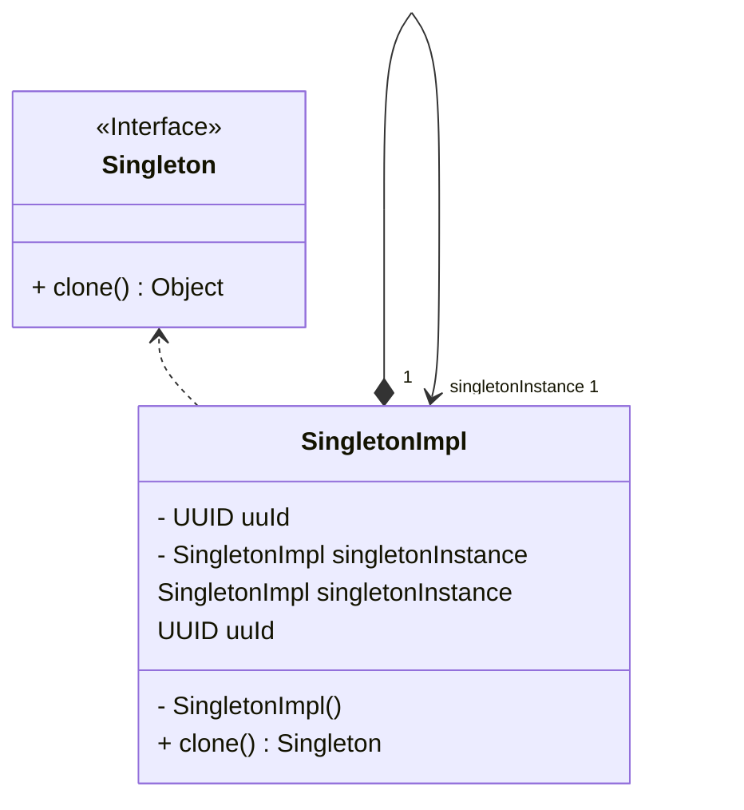

## Singleton Tasarım Deseni Nedir?

Singleton tasarım deseni, yazılım geliştirme sürecinde sıklıkla kullanılan bir tasarım desenidir. Bu desen, bir sınıfın yalnızca bir örneğinin oluşturulmasını ve bu örneğe global erişimin sağlanmasını amaçlar. Yalnızca bir örneğin oluşturulması, kaynak kullanımını optimize ederken, global erişim ise uygulama genelinde tutarlılık sağlar.

Bu tasarım deseni genellikle ihtiyaç duyulan tek bir nesnenin varlığını garanti etmek için kullanılır. Örneğin, veritabanı bağlantısı, dosya işlemleri veya ayar yönetimi gibi durumlarda Singleton tasarım deseni tercih edilebilir. Bu sayede, uygulama genelinde aynı nesnenin kullanılması sağlanarak veri bütünlüğü korunur.

Singleton tasarım deseni, genellikle aşağıdaki özelliklere sahiptir:

1. Özel bir kurucu metot: Sınıfın dışından erişilemeyen bir kurucu metot ile sadece bir örneğin oluşturulmasını sağlar.

2. Static bir referans: Oluşturulan tek örnek, static bir referans ile tutulur ve uygulama genelinde erişime olanak tanır.

3. Lazy initialization (Tembel İlkelleştirme): Örneğin oluşturulması, ihtiyaç duyulduğunda gerçekleşir. Bu sayede gereksiz kaynak kullanımı önlenir.

Singleton tasarım deseninin avantajları arasında kaynak kullanımının optimize edilmesi, tutarlılık ve bütünlüğün sağlanması ve global erişimin kolaylaştırılması bulunur. Ancak, yanlış implementasyonlarından dolayı bazı dezavantajları da olabilir. Örneğin, çoklu iş parçacığı ortamlarında senkronizasyon sorunları yaşanabilir.

Sonuç olarak, Singleton tasarım deseni, yazılım geliştirme sürecinde tek bir örneğin oluşturulmasını ve bu örneğe global erişimin sağlanmasını amaçlayan önemli bir tasarım desenidir. Doğru senaryolarda ve doğru şekilde implemente edildiğinde, uygulamanın performansını artırabilir ve tutarlılığı sağlayabilir. Ancak, dikkatli bir şekilde kullanılmalı ve gereksiz yere zorlanmamalıdır.

---

The Singleton Design Pattern, what's it about?

The Singleton pattern is used to ensure that a class has only one instance and to provide a global point of access to it. This pattern is designed to resolve conflicts by focusing on a single responsibility in accordance with programming principles.

Essentially, the Singleton pattern focuses on ensuring that there is only one instance of a class. This approach ensures that the same instance is always used. Additionally, the Singleton pattern serves as a general access point by securely storing important objects.

Useful for providing a single solution within a class without dispersing throughout the program, the Singleton pattern is preferred in cases where all clients need to use only one instance. It also provides tighter control over global variables.

This pattern is also associated with other design patterns such as Abstract Factory, Builder, and Prototype, and even applications of Singleton can be made to these patterns. However, despite some differences, it bears similarities to structural design patterns like Facade and Flyweight.

In conclusion, the Singleton Design Pattern is a preferred design pattern that adheres to programming principles by focusing on a single responsibility and ensuring that all clients use only one instance.

---

# Singleton Örneği UML Class Diyagramı

