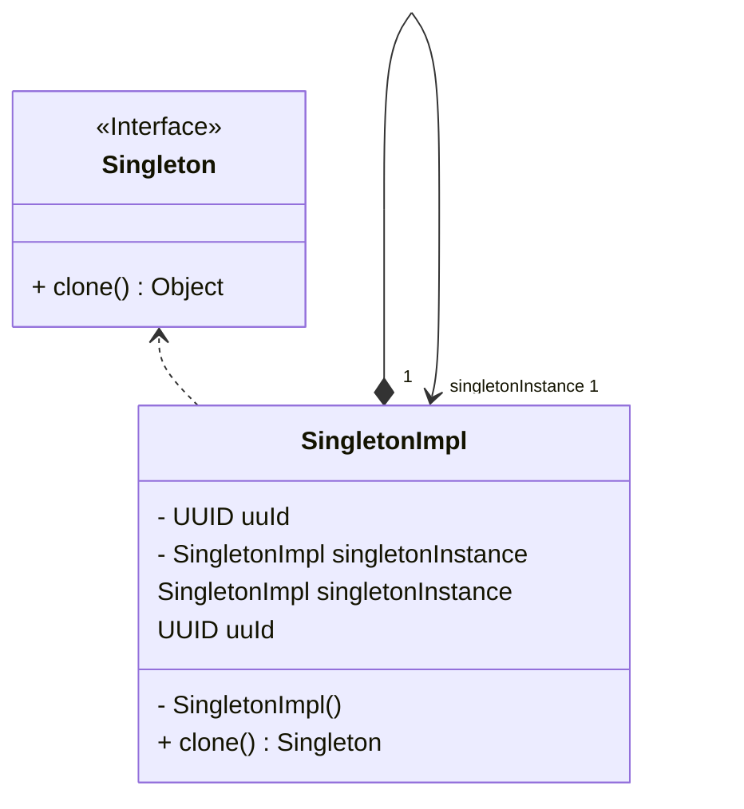

* Singleton Design Pattern Nedir?

Singleton Tasarım Deseni, bir sınıfın yalnızca bir tane örneğinin olduğundan emin olmak için kullanılır. Yani, sanki sınıfın dünyada sadece bir tane mağazası varmış gibi düşün. Bu desen, sınıfın içinde tek bir örnek oluşturarak herkesin ona erişmesini sağlar. Mesela, herkes aynı mağazaya gider ve hep aynı ürünleri alır. Bu şekilde, herkes aynı örnek üzerinde işlem yapar ve kafası karışmaz.

Singleton deseni, programlama kurallarına uygun bir şekilde, tek bir görevle ilgilenmek için yapılmıştır. Bu desen, sınıfın içinde sadece bir tane örnek olduğunu garanti eder. Bu sayede, herkes aynı örneği kullanır. Aynı zamanda, Singleton deseni, önemli nesnelerin güvenle saklanmasını sağlar ve herkesin onlara erişmesini kolaylaştırır.

Bu desen, program içinde bir sınıfın içinde herhangi bir yerden dağılmadan tek bir çözüm sunar. Yani, sanki herkes aynı hikayeyi dinliyormuş gibi düşün. Bu desen, herkesin aynı hikayeyi anlamasını sağlar ve kafalar karışmaz. Özellikle, tüm istemcilerin aynı hikayeyi dinlemesi gerektiğinde çok işe yarar.

Singleton Tasarım Deseni, diğer tasarım desenleriyle de ilişkilendirilmiştir. Mesela, Abstract Factory, Builder ve Prototype gibi. Bu desenlerin hepsi, sınıfın içinde tek bir örnek oluşturmayı sağlar. Fakat, Singleton deseni, bazı farklılıklarla da öne çıkar. Mesela, farklı tiplerdeki tasarım desenleri gibi düşünebilirsin. Ama herkesin aynı tipte bir deseni olduğunu düşün.

Sonuç olarak, Singleton Tasarım Deseni, programlama kurallarına uygun şekilde, tek bir görevle ilgilenerek ve herkesin aynı şeyi görmesini sağlayan  bir tasarım desenidir.

---

The Singleton Design Pattern, what's it about?

The Singleton pattern is used to ensure that a class has only one instance and to provide a global point of access to it. This pattern is designed to resolve conflicts by focusing on a single responsibility in accordance with programming principles.

Essentially, the Singleton pattern focuses on ensuring that there is only one instance of a class. This approach ensures that the same instance is always used. Additionally, the Singleton pattern serves as a general access point by securely storing important objects.

Useful for providing a single solution within a class without dispersing throughout the program, the Singleton pattern is preferred in cases where all clients need to use only one instance. It also provides tighter control over global variables.

This pattern is also associated with other design patterns such as Abstract Factory, Builder, and Prototype, and even applications of Singleton can be made to these patterns. However, despite some differences, it bears similarities to structural design patterns like Facade and Flyweight.

In conclusion, the Singleton Design Pattern is a preferred design pattern that adheres to programming principles by focusing on a single responsibility and ensuring that all clients use only one instance.

---

# Singleton Örneği UML Class Diyagramı

