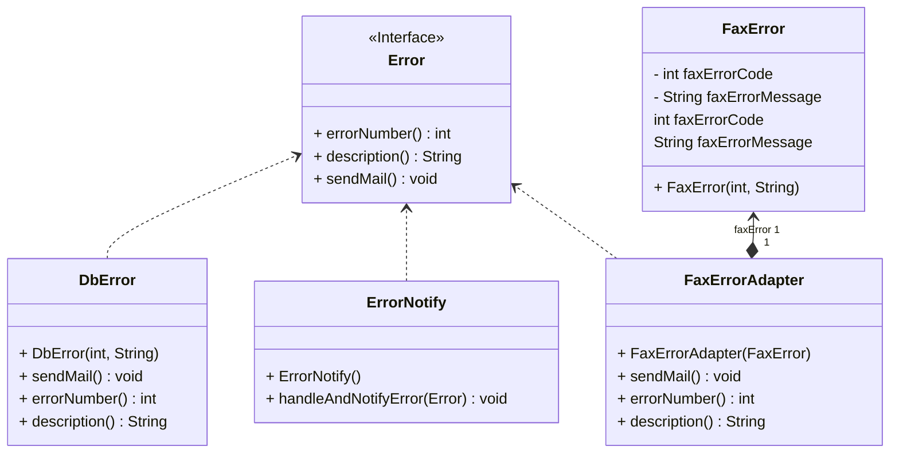
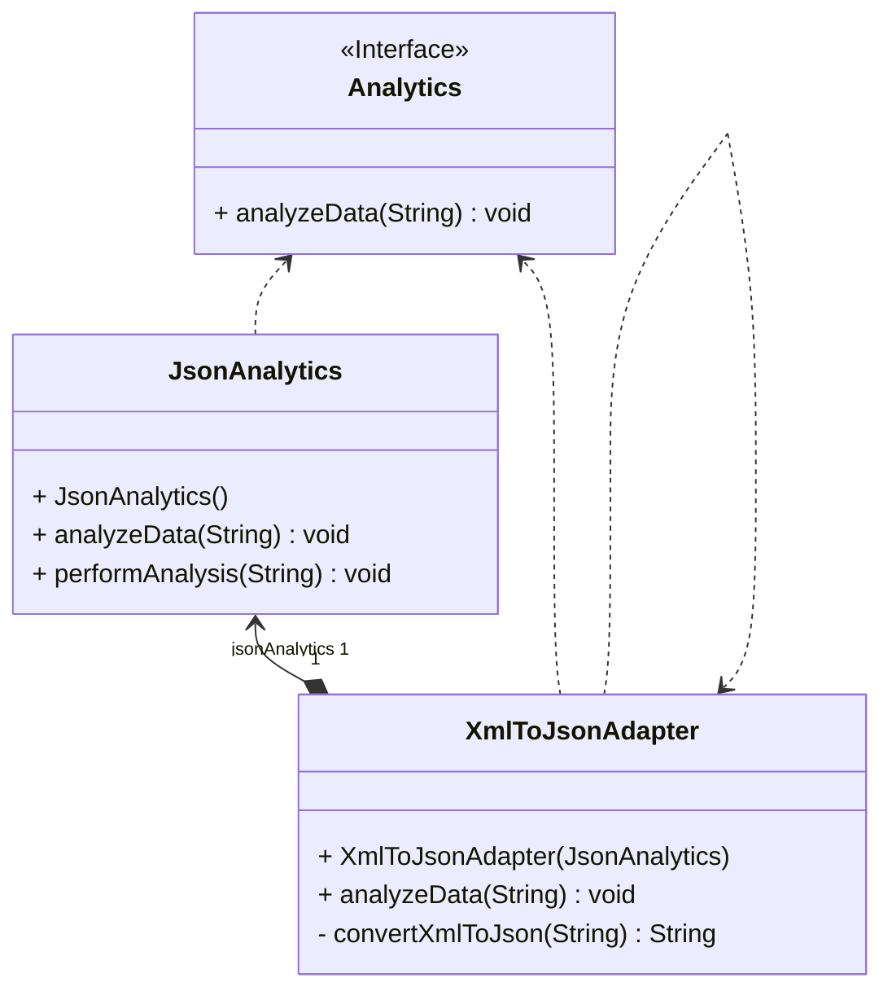

# Adaptör Tasarım Deseni Nedir?

Adapter deseni, birbiriyle uyumlu olmayan arayüzlere sahip nesnelerin birlikte çalışabilmelerini sağlayan bir yapısal tasarım desenidir. Bu desen, mevcut bir sınıf veya üçüncü parti kütüphane ile kodunuzun arasında bir nevi tercüman olarak hizmet eden bir ara katman oluşturmanızı sağlar.

## Örnek Senaryo

Hisse senedi piyasalarını takip etmeyi sağlayan bir uygulama geliştiriyorsunuz. Uygulama, piyasa verilerini farklı kaynaklardan XML formatında çekiyor ve daha sonra kullanıcıya güzel grafikler ve diyagramlar ile sunuyor. Bir gün, üçüncü parti bir analiz kütüphanesi entegre etmek istediğinizi varsayalım. Ancak, bu analiz kütüphanesi yalnızca JSON formatı ile çalışabiliyor.

Bu noktada adaptör desenini devreye sokabilirsiniz. Analiz kütüphanesinin tüm sınıfları için bir XML-JSON çevirici adaptörü yazarak, kodunuz içerisinde bu adaptörü kullanabilirsiniz. Adaptör bir çağrı aldığında, gelen XML verisini JSON yapısına dönüştürür ve çağrıyı uygun metodlarla sarmaladığı analiz nesnesine aktarır.

Adaptörler, sadece veriyi farklı formatlara dönüştürmeyi değil, aynı zamanda farklı arayüzlerin birlikte çalışmasını sağlar. Bir adaptör, mevcut nesnelerden biriyle uyumlu bir arayüzü alır ve bu arayüzü kullanarak adaptörün metodlarını güvenli bir şekilde çağırabilir.

## Kullanım Alanları

Adaptör tasarım deseni, mevcut bir sınıfı kullanmak istediğiniz fakat o sınıfın arayüzünün kodunuzun geri kalanı ile uyumlu olmadığı zamanlarda kullanılabilir. Bu sayede mevcut kodunuzla doğrudan uyumlu olmayan bir sınıf veya üçüncü parti kütüphane ile entegrasyon sağlayabilirsiniz.

## Diğer Tasarım Desenleri ile İlişkisi

Adaptör deseninin diğer tasarım desenleri/kalıpları ile ilişkisi de bulunmaktadır. Örneğin, Köprü (Bridge) deseni uygulamanın farklı bölümlerini birbirinden bağımsız olarak geliştirmeniz için kullanılırken, adaptör mevcut bir uygulamada kullanılarak birbiri ile uyumsuz sınıfların birlikte çalışmasını sağlar.

## Sonuç

Adaptör tasarım deseni mevcut kodunuzla uyumsuz olan sınıfların birlikte çalışmasını sağlayarak, uygulamanızın genişletilebilirliğini artırır ve kodunuzu daha modüler hale getirir. Bu sayede gelecekteki değişikliklere daha kolay adapte olabilir ve yeni entegrasyonları sorunsuz bir şekilde gerçekleştirebilirsiniz.

---

# What is the Adapter Design Pattern?

The Adapter pattern is a structural design pattern that enables objects with incompatible interfaces to work together. This pattern serves as an intermediary layer that acts as a translator between your existing class or third-party library and your code.

## Example Scenario

Imagine you are developing an application to track stock markets. The application retrieves market data from various sources in XML format and then presents it to the user with visually appealing graphs and diagrams. One day, let's say you decide to enhance the application by integrating a third-party analytics library. However, there's a catch: this analytics library only works with JSON format.

At this point, you can introduce the adapter pattern. By writing an XML-to-JSON converter adapter for all classes of the analytics library, you can use this adapter within your code. When the adapter receives a call, it converts the incoming XML data into JSON structure and transfers the call to the analysis object wrapped with appropriate methods.

Adapters not only convert data to different formats but also enable different interfaces to work together. An adapter takes an interface compatible with one of the existing objects and securely invokes the adapter's methods using this interface.

## Use Cases

The Adapter design pattern can be used when you want to use an existing class but its interface is incompatible with the rest of your code. This allows you to integrate a class or third-party library that is not directly compatible with your existing codebase.

## Relationship with Other Design Patterns

The Adapter pattern has relationships with other design patterns. For example, while the Bridge pattern is used to develop different parts of an application independently before those parts are coded, the Adapter allows incompatible classes to work together within an existing application.

## Conclusion

The Adapter design pattern facilitates the collaboration of classes that are incompatible with your existing codebase, thereby increasing the extensibility of your application and making your code more modular. This allows for easier adaptation to future changes and seamless integration of new functionalities.

---

# Fax Error Adapter Örneği UML Class Diyagramı

---

# XML to JSON Uygulama Örneği UML Class Diyagramı

