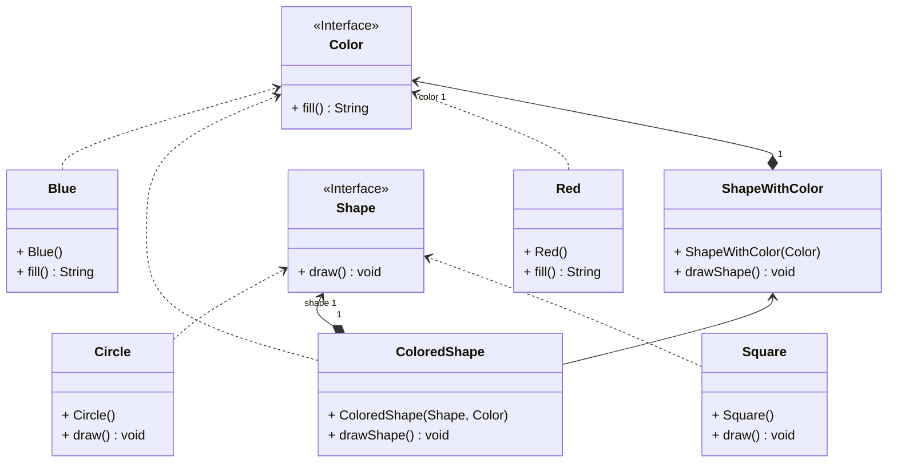

# Bridge Tasarım Deseni: Yazılım Geliştirme Sürecinde Soyutlama ve Uygulamanın Ayrılması

Yazılım geliştirme sürecinde, büyük sınıfları veya birbiriyle yakından ilişkili sınıfları bağımsız olarak geliştirmek ve yönetmek önemlidir. Bu gibi durumlarda, Bridge tasarım deseni devreye girer. Bu tasarım deseni, bir sınıfı iki ayrı hiyerarşiye bölen ve aralarındaki bağımlılığı azaltan bir yapı sağlar.

Soyutlama ve Uygulama kavramları genellikle kafa karıştırıcı olabilir. Örneğin, Shape adında bir sınıfın altında Circle ve Square gibi alt sınıflarının bulunduğunu düşünelim. Bu hiyerarşiyi renkleri de içerecek şekilde genişletmek istediğimizde her iki boyuttaki her kombinasyon için ayrı alt sınıflar oluşturmamız gerekecektir. Bu durumda, köprü deseni devreye girerek bu karmaşıklığı önler.

Köprü deseni, kalıtım yerine nesne bileşimi kullanarak Abstraction ve Implementation kavramlarını ayırır. Bu sayede, sınıf hiyerarşisinin gereksiz büyümesi engellenir. Bu desen, monolitik bir sınıfı parçalara bölmek ve yönetmek istediğinizde, bir sınıfı bağımsız birden fazla boyuta genişletmek istediğinizde veya çalışma anında uygulama yöntemlerini değiştirmek istediğinizde kullanılabilir.

Köprü deseni ayrıca diğer tasarım desenleri ile de ilişkilidir. Örneğin, Adaptör deseni mevcut bir uygulamada kullanılarak birbiri ile uyumsuz sınıfların birlikte çalışmasını sağlar. Köprü deseni ile Abstract Factory deseni birlikte kullanılabilir. Köprü desenindeki soyutlamalar sadece belirli uygulanışlar için geçerli olduğunda bu iş birliği kullanışlı olabilir. Ayrıca, Builder ve Köprü deseni birleştirilebilir. Yönetici sınıf soyutlama rolünü oynarken, farklı builder'lar uygulanışı belirler.

Bu şekilde, köprü tasarım deseninin yazılım geliştirme sürecindeki önemi ve kullanım alanları hakkında genel bir bakış elde ettik. Bu desen, karmaşık hiyerarşik yapıları önleyerek yazılım geliştirme sürecini daha yönetilebilir hale getirir. Uygulanabilirlik, diğer tasarım desenleri ile ilişkileri ve avantajları göz önünde bulundurulduğunda, köprü deseninin yazılım geliştirme projelerinde değerli bir araç olduğu söylenebilir.

---

# Bridge Design Pattern: Decoupling Abstraction and Implementation in Software Development

In software development, it is important to develop and manage large classes or closely related classes independently. In such cases, the Bridge design pattern comes into play. This design pattern divides a class into two separate hierarchies and reduces dependency between them.

The concepts of Abstraction and Implementation can often be confusing. For example, consider a class named Shape with subclasses like Circle and Square. If we want to extend this hierarchy to include colors, we would need separate subclasses for each combination of shape and color. Here, the bridge pattern intervenes to minimize this complexity.

The Bridge pattern separates Abstraction and Implementation using object composition instead of inheritance. This prevents unnecessary growth of the class hierarchy. This pattern can be used when you want to divide and manage a monolithic class into parts, when you want to independently extend a class to multiple dimensions, or when you want to change implementation methods at runtime.

The Bridge pattern is also related to other design patterns. For instance, the Adapter pattern allows incompatible classes to work together in an existing application. The Bridge pattern can be used together with the Abstract Factory pattern, especially when the abstractions in the bridge pattern are only valid for certain implementations. Additionally, the Builder and Bridge patterns can be combined, where the director class plays the abstraction role while different builders determine the implementation.

In this way, we have gained a general understanding of the importance and use cases of the bridge design pattern in software development. By preventing complex hierarchical structures, this pattern makes the software development process more manageable. Considering its relationships with other design patterns and its advantages, it can be said that the bridge pattern is a valuable tool in software development projects.

---

# Renkli Şekil Çizme Uygulama Örneği UML Class Diyagramı

