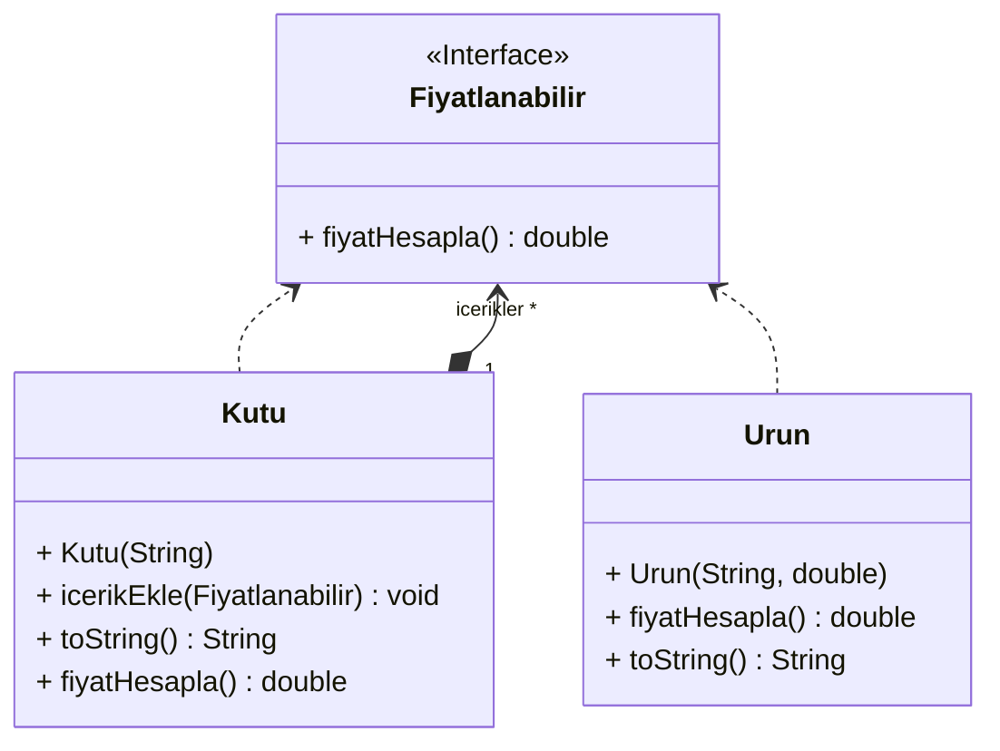

# Composite Tasarım Deseni

Composite tasarım deseni, nesnelerin ağaç yapıları halinde oluşturulmasına ve bu ağacın dalları ile tek tek nesnelermiş gibi çalışılmasına olanak sağlayan bir tasarım desenidir. Bu desen, özellikle uygulamanın ana modelinin ağaç şeklinde gösterilebildiği durumlarda kullanılabilir.

Örnek olarak, ürünler ve kutular şeklinde iki tür nesnenin olduğunu düşünelim. Bir kutu birden fazla ürün içerebilir ve hatta daha küçük kutular da içerebilir. Bu kutuların içinde de ürünler ya da daha küçük kutular olabilir. Bu durumda, bir sıralama sistemi yaparken herhangi bir paketleme yapılmayan basit ürünlerin yanı sıra içi birçok ürünle dolu kutuların toplam fiyatını belirlemek gerekebilir.

Composite deseni, ürünler ve kutularla çalışırken, fiyatı hesaplamak için ortak bir arayüz kullanmayı önerir. Bu arayüz, her bir nesnenin kendi fiyatını döndürmesini sağlar. Eğer bir nesne bir kutu ise, içindeki tüm öğelere gidip onlara fiyatlarını sorar ve toplamı döndürür. Böylece hiçbir kutu, daha alt seviyelerde ne olduğunu bilmek zorunda kalmaz.

Composite deseni, bir çağrıyı bir nesne ağacındaki tüm bileşenler için öz yinelemeli olarak çağırabilmenizi sağlar. Bu sayede, ağaçtaki nesnelerin tam sınıflarını bilmeniz gerekmez. Nesnenin tipinden bağımsız olarak, ortak arayüzdeki metodu içermesi yeterlidir.

Bu metodun en avantajlı tarafı, nesnenin basit bir ürün mü yoksa karmaşık içerikli bir kutu mu olduğunu önceden bilmeniz gerekmemesidir. Bir metodu çağırdığınızda daha aşağılara inilmesi gerekiyorsa ilgili nesne bunu kendisi yapacaktır.

Composite tasarım deseni, ağaç yapılarına sahip nesnelerle çalışırken esneklik ve kolaylık sağlar. Bu sayede, uygulamanın genişleyebilirliği ve bakımı kolaylaşır. Bu desen, özellikle karmaşık yapıya sahip nesnelerin yönetildiği durumlarda tercih edilebilir.

---
# Composite Design Pattern

The Composite design pattern is a design pattern that allows objects to be created in tree structures and enables working with individual branches of this tree as if they were individual objects. This pattern can be particularly useful when the main model of the application can be represented in a tree-like structure.

For example, consider two types of objects: Products and Boxes. A box can contain multiple products, and it can even contain smaller boxes. These boxes, in turn, can contain products or even smaller boxes. In such a scenario, when implementing a sorting system, you may need to determine the total price of orders that contain not only simple products but also boxes filled with multiple products.

The Composite pattern suggests using a common interface for calculating the price while working with products and boxes. This interface allows each object to return its own price. If an object is a box, it goes through all the items inside it, asks them for their prices (using the same interface), and returns the total. Thus, no box needs to know what is at lower levels.

The Composite pattern enables you to recursively call a method for all components in an object tree. Consequently, you don't need to know the exact classes of the objects in the tree. Regardless of the type of the object, as long as it implements the common interface, it is sufficient.

The most advantageous aspect of this method is that you don't need to know beforehand whether an object is a simple product or a complex box. If a method call requires going further down, the relevant object will handle it by itself.

The Composite design pattern provides flexibility and ease of use when working with objects that have tree structures. As a result, the extensibility and maintainability of the application are enhanced. This pattern is particularly preferred in cases where objects with complex structures are managed.

---
# Alışveriş Sepeti Uygulaması Örnek UML Diyagramı

