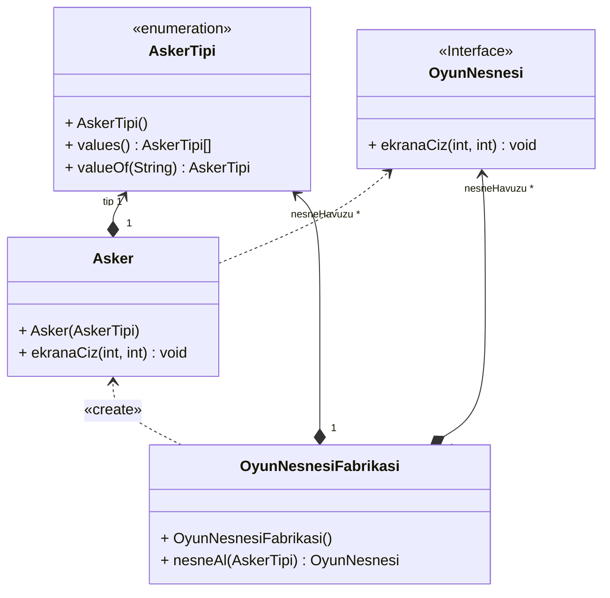

# Flyweight Tasarım Deseni

Flyweight tasarım deseni, yazılım geliştirme sürecinde hafıza (RAM) kullanımını optimize etmek amacıyla kullanılan bir yapısal tasarım desenidir. Bu desen, aynı veriye sahip nesnelerin hafızada tekrar tekrar tutulması yerine paylaşılmasını sağlayarak hafıza kullanımını minimize etmeyi hedefler.

Çoğu yazılım uygulamasında benzer veya aynı veriye sahip çok sayıda nesne oluşturulabilir. Bu durumda her bir nesne aynı veriyi tekrar tekrar tutarsa hafıza kullanımı artabilir. Flyweight deseni, bu tür durumlarda ortak veriyi paylaşarak hafızada daha az yer kaplayan nesneler oluşturmayı sağlar.

Örneğin, bir oyun uygulamasında her bir mermi, roket veya patlama parçası için ayrı ayrı nesneler oluşturmak yerine, bu nesnelerin ortak özelliklerini paylaşan ve sadece farklılıkları içeren nesneler oluşturulabilir. Böylece hafızada gereksiz tekrarlamaların önüne geçilerek daha verimli bir hafıza kullanımı sağlanabilir.

Flyweight deseni, içsel durum (intrinsic state) ve dışsal durum (extrinsic state) kavramları üzerine kuruludur. İçsel durum, nesnenin ortak özelliklerini ve sabit verilerini temsil ederken, dışsal durum ise nesnenin değişen özelliklerini ve bağlamını temsil eder. Flyweight deseni, içsel durumu paylaşan nesneleri oluştururken dışsal durumu ayrıştırarak her bir nesnenin sadece değişen özelliklerini tutmasını sağlar.

Bu desenin uygulanmasıyla, benzer nesneler arasında paylaşılan veri miktarı artar ve hafıza kullanımı optimize edilir. Ayrıca, flyweight nesnelerinin değişmez (immutable) olmaları sağlanarak farklı bağlamlarda güvenle kullanılabilirler.

Flyweight deseni, özellikle benzer özelliklere sahip çok sayıda nesnenin oluşturulması gereken durumlarda etkili bir şekilde kullanılabilir. Bu desen sayesinde hafıza kullanımının minimize edilmesi ve performansın artırılması mümkün olmaktadır.

Sonuç olarak, flyweight tasarım deseni yazılım geliştirme sürecinde hafıza kullanımının optimize edilmesini sağlayan ve benzer nesneler arasında veri paylaşımını destekleyen önemli bir yapısal tasarım desenidir. Bu desenin doğru ve etkili bir şekilde kullanılmasıyla yazılım uygulamalarının performansı artırılabilir ve hafıza kullanımı minimize edilebilir.

---

# What is the Flyweight Design Pattern?

The Flyweight design pattern is a structural design pattern used to optimize memory (RAM) usage in software development. This pattern aims to minimize memory usage by sharing objects that have the same data instead of repeatedly holding them in memory.

In many software applications, numerous objects with similar or identical data can be created. If each object holds the same data repeatedly, memory usage can increase. The Flyweight pattern addresses this issue by allowing the sharing of common data among objects, resulting in the creation of objects that occupy less memory space.

For example, in a game application, instead of creating separate objects for each bullet, rocket, or explosion part, we can create objects that share common properties and only differ in their unique characteristics. This approach avoids unnecessary repetitions in memory and leads to more efficient memory usage.

The Flyweight pattern is based on the concepts of intrinsic state and extrinsic state. The intrinsic state represents the common properties and constant data of the object, while the extrinsic state represents the object's varying properties and context. When creating objects that share intrinsic state, the Flyweight pattern separates the extrinsic state, allowing each object to only store its changing properties.

By implementing this pattern, the amount of shared data among similar objects increases, and memory usage is optimized. Additionally, ensuring that flyweight objects are immutable allows them to be safely used in different contexts.

The Flyweight pattern is particularly effective in situations where numerous objects with similar properties need to be created. This pattern enables the minimization of memory usage and the enhancement of performance.

In conclusion, the Flyweight design pattern is an important structural design pattern that optimizes memory usage and supports data sharing among similar objects. Correct and effective utilization of this pattern can lead to improved performance and minimized memory consumption in software applications.

---

